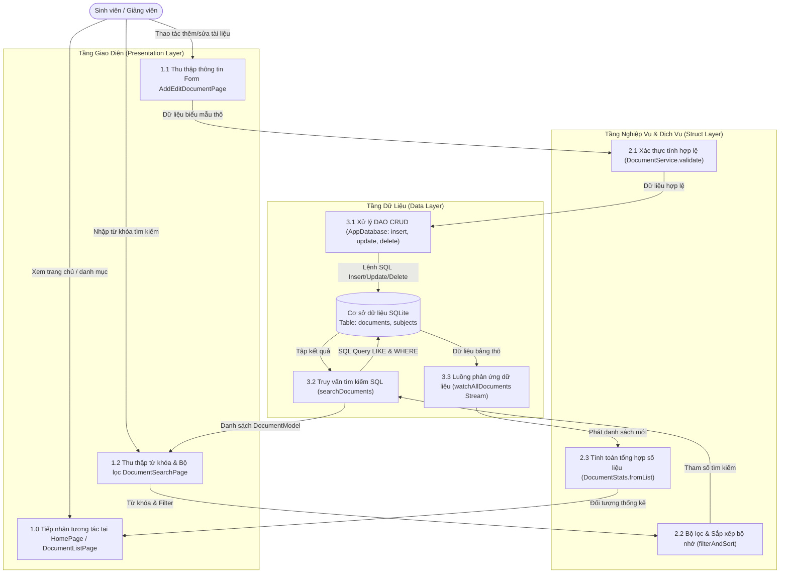

# BÁO CÁO THỰC HÀNH TH1
# XÂY DỰNG ỨNG DỤNG QUẢN LÝ TÀI LIỆU HỌC TẬP THEO KIẾN TRÚC CASHEW

- **Học phần:** Phát triển Ứng dụng Di động / Kiến trúc và Thiết kế Phần mềm
- **Chủ đề:** Áp dụng nguyên lý Kiến trúc Cashew vào bài toán Quản lý tài liệu học tập
- **Công nghệ triển khai:** Flutter (Dart) & SQLite (Drift Pattern)
- **Tình trạng nộp bài:** Hoàn chỉnh mã nguồn, bộ kiểm thử 100% pass và tài liệu giải trình kiến trúc.

---

## 📋 MỤC LỤC BÁO CÁO (ĐÁP ỨNG ĐỦ 5 MỤC CHECKLIST)
1. **Mục 1: Phân tích yêu cầu chức năng và Thiết kế sơ đồ luồng dữ liệu (DFD)**
2. **Mục 2: Thiết lập cấu trúc thư mục và Phân lớp hệ thống theo chuẩn Kiến trúc Cashew**
3. **Mục 3: Triển khai các chức năng cốt lõi: Thêm, Sửa, Xóa và Tìm kiếm tài liệu**
4. **Mục 4: Kiểm thử tính đúng đắn của việc phân tách logic giữa các lớp**
5. **Mục 5: Đóng gói mã nguồn và Hướng dẫn triển khai dự án**

---

# MỤC 1: PHÂN TÍCH YÊU CẦU CHỨC NĂNG & SƠ ĐỒ LUỒNG DỮ LIỆU (DFD)

## 1.1. Bối cảnh bài toán và Yêu cầu chức năng
Ứng dụng **Quản lý Tài liệu Học tập** được thiết kế nhằm giải quyết nhu cầu tổ chức, lưu trữ bài giảng, bài tập, đề cương và tài liệu tham khảo cho sinh viên trong từng học kỳ.

### Danh sách yêu cầu chức năng cụ thể:
- **F1 - Quản lý Danh mục Môn học (Subjects):**
  - Quản lý thông tin môn học (Mã môn, Tên môn, Màu sắc đặc trưng, Biểu tượng nhận diện).
  - Phân loại tài liệu học tập theo từng học phần tương ứng.
- **F2 - Thêm mới tài liệu (Create):**
  - Nhập tiêu đề tài liệu (kiểm tra độ dài từ 3 đến 250 ký tự).
  - Chọn môn học liên kết.
  - Phân loại tài liệu theo 4 nhóm chính:
    1. *Bài giảng (Lecture)*
    2. *Bài tập / Đồ án (Assignment)*
    3. *Tài liệu tham khảo (Reference)*
    4. *Đề thi / Đề cương ôn tập (Exam)*
  - Nhập liên kết trực tuyến (Drive, Website) hoặc đường dẫn tệp nội bộ.
  - Thiết lập thời hạn nộp bài (Deadline) kèm cảnh báo đếm ngược thời gian.
  - Gắn nhãn phân loại (Tags), ghi chú tóm tắt và đánh dấu tài liệu quan trọng (Favorite).
- **F3 - Chỉnh sửa thông tin tài liệu (Update):**
  - Cập nhật linh hoạt thông tin tài liệu, chuyển đổi phân loại hoặc thay đổi môn học.
  - Đánh dấu hoàn thành / chưa hoàn thành bài tập (Assignment Status Toggle).
- **F4 - Xóa tài liệu học tập (Delete):**
  - Xóa tài liệu khỏi hệ thống có hộp thoại cảnh báo (Confirmation Dialog) chống thao tác nhầm.
- **F5 - Tìm kiếm và Lọc đa năng (Search & Filtering):**
  - Tìm kiếm toàn văn (Full-text Search) theo từ khóa xuất hiện trong: Tiêu đề, Ghi chú, Thẻ phân loại (Tags).
  - Tích hợp bộ đệm thời gian (Debounce 300ms) để tối ưu hiệu năng CPU và hạn chế truy vấn thừa.
  - Bộ lọc kết hợp: Lọc theo Loại tài liệu (Filter Chips), Lọc theo Môn học (Dropdown), Lọc theo Tài liệu quan trọng.
- **F6 - Bảng điều khiển & Thống kê tổng quan (Dashboard Summary):**
  - Hiển thị tổng số tài liệu, số lượng từng phân loại, số bài tập chưa hoàn thành và cảnh báo bài tập sắp đến hạn.

---

## 1.2. Thiết kế Sơ đồ Luồng Dữ liệu (Data Flow Diagrams)

### 1.2.1. DFD Cấp 0 (Sơ đồ Ngữ cảnh - Context Diagram)

```
       ┌────────────────┐
       │                │── (1) Thêm, Sửa, Xóa, Tìm kiếm, Đánh dấu ──►┌─────────────────────────────────────────┐
       │                │                                              │                                         │
       │   SINH VIÊN    │                                              │  HỆ THỐNG QUẢN LÝ TÀI LIỆU HỌC TẬP      │
       │  (NGƯỜI DÙNG)  │                                              │      (KIẾN TRÚC CASHEW FLUTTER)         │
       │                │                                              │                                         │
       │                │◄── (2) Danh sách tài liệu, Cảnh báo hạn nộp ─┴─────────────────────────────────────────┘
       └────────────────┘        Kết quả tìm kiếm, Báo cáo thống kê
```

### 1.2.2. DFD Cấp 1 (Chi tiết Tiến trình xử lý theo Kiến trúc Phân tầng)



---

# MỤC 2: CẤU TRÚC THƯ MỤC & PHÂN LỚP HỆ THỐNG THEO TIÊU CHUẨN CASHEW

## 2.1. Triết lý phân tầng của Kiến trúc Cashew
Dự án gốc Cashew áp dụng mô hình phân tách cực kỳ tường minh nhằm đảm bảo:
1. **Tính độc lập của logic nghiệp vụ:** Tầng giao diện không được chứa câu lệnh SQL; tầng cơ sở dữ liệu không được phụ thuộc vào Widget hay BuildContext.
2. **Cơ chế phản ứng dữ liệu thời gian thực (Reactive Stream Pattern):** Mọi thay đổi tại CSDL lập tức được Stream phát ra toàn bộ ứng dụng, các màn hình tự động cập nhật mà không cần truyền callback phức tạp.
3. **Mô-đun hóa (Modularity) và Tái sử dụng (Reusability):** Chia nhỏ các widget giao diện thành các thành phần dùng chung (PageFramework, PopupFramework, Cards, SearchBar).

## 2.2. Bảng đối chiếu cấu trúc thư mục với dự án Cashew

| Thư mục / Tệp trong Cashew | Thư mục trong Đề tài Quản lý Tài liệu | Trách nhiệm và Phân lớp kiến trúc |
|:---|:---|:---|
| `lib/database/tables.dart` | `lib/database/tables.dart` | **Data Layer:** Khai báo cấu trúc bảng SQLite (Subjects, Documents) |
| `lib/database/tables.g.dart` & `tables.dart` | `lib/database/app_database.dart` | **Data Layer:** Kết nối CSDL SQLite, các thao tác DAO, Reactive Stream |
| `lib/struct/databaseGlobal.dart` | `lib/database/databaseGlobal.dart` | **Data Layer:** Khởi tạo biến toàn cục `database` chuẩn Cashew Singleton |
| `lib/struct/settings.dart` | `lib/struct/document_global.dart` | **Struct Layer:** Quản lý trạng thái chia sẻ (Selected Subject, Filter, Favorites) |
| `lib/struct/...functions.dart` | `lib/struct/document_service.dart` | **Struct Layer:** Toàn bộ Business Logic: Validation, Filter, Sort, Thống kê |
| `lib/struct/currencyFunctions.dart` | `lib/struct/formatters.dart` | **Struct Layer:** Định dạng ngày tháng, hạn nộp, chuỗi ký tự hiển thị |
| `lib/widgets/framework/` | `lib/widgets/framework/` | **Presentation Layer:** Khung chuẩn Scaffold, Appbar, Dialog |
| `lib/widgets/...Entry.dart` | `lib/widgets/document_card.dart` | **Presentation Layer:** Thẻ hiển thị tài liệu, huy hiệu màu sắc, menu hành động |
| `lib/pages/homePage/` | `lib/pages/home_page.dart` | **Presentation Layer:** Màn hình chính Dashboard tổng quan |
| `lib/pages/...ListPage.dart` | `lib/pages/document_list_page.dart`| **Presentation Layer:** Quản lý danh sách tài liệu đầy đủ |
| `lib/pages/add...Page.dart` | `lib/pages/add_edit_document_page.dart`| **Presentation Layer:** Biểu mẫu Thêm và Sửa tài liệu |
| `lib/pages/...SearchPage.dart` | `lib/pages/document_search_page.dart`| **Presentation Layer:** Giao diện tìm kiếm chuyên sâu |
| `lib/colors.dart` | `lib/colors.dart` | **Theme System:** Quản lý màu sắc, Light Theme & Dark Theme |
| `lib/functions.dart` | `lib/functions.dart` | **Global Helpers:** Hàm điều hướng (pushRoute), Snackbar, BottomSheet |

---

# MỤC 3: TRIỂN KHAI CÁC CHỨC NĂNG CỐT LÕI (CRUD & SEARCH)

Toàn bộ mã nguồn đã được chú thích chi tiết bằng tiếng Việt theo mẫu `// [KIẾN TRÚC CASHEW - LỚP ...]` giúp người chấm dễ dàng kiểm tra.

### 3.1. Chức năng Thêm mới tài liệu (Create)
- Được triển khai tại `lib/pages/add_edit_document_page.dart` kết hợp với `DocumentService.saveDocument`.
- Khi người dùng gửi biểu mẫu:
  1. Gọi `DocumentService.validateTitle(title)` để kiểm tra độ dài và dữ liệu rỗng.
  2. Gọi `DocumentService.validateUrl(url)` để kiểm tra cấu trúc URL.
  3. Đóng gói thành `DocumentModel` với mã định danh duy nhất (UUID v4).
  4. Thực hiện `database.insertDocument(newDoc)` tại tầng Data Layer.
  5. Phát tín hiệu qua `notifyDocumentsChanged()` để giao diện cập nhật ngay lập tức.

### 3.2. Chức năng Chỉnh sửa tài liệu (Update)
- Màn hình `AddEditDocumentPage` tự động phát hiện chế độ sửa khi truyền vào `initialDocument`.
- Người dùng có thể chỉnh sửa tiêu đề, đổi môn học, cập nhật ghi chú, thay đổi thời hạn nộp bài.
- Cung cấp thao tác nhanh: Đổi trạng thái bài tập (Chưa nộp ➔ Đã nộp bài) trực tiếp ngay trên `DocumentCard` và `DocumentDetailPage` mà không cần vào form sửa.

### 3.3. Chức năng Xóa tài liệu (Delete)
- Thực hiện qua `DocumentService.deleteDocument(id)` và `database.deleteDocument(id)`.
- Tích hợp widget `ConfirmDeleteDialog` theo chuẩn `PopupFramework` của Cashew để cảnh báo người dùng trước khi xóa vĩnh viễn.

### 3.4. Chức năng Tìm kiếm tài liệu (Search & Filtering)
- Triển khai tại `lib/pages/document_search_page.dart` và phương thức `database.searchDocuments()`.
- Hỗ trợ tìm kiếm không phân biệt hoa thường trên 3 trường: `title`, `notes`, `tags`.
- Tích hợp `DocumentSearchBar` với `Timer` Debounce 300ms, giúp hạn chế gọi truy vấn liên tục khi người dùng đang gõ phím.
- Kết hợp đồng thời bộ lọc loại tài liệu (Bài giảng / Bài tập / Tham khảo / Đề thi) và bộ lọc môn học.

---

# MỤC 4: KIỂM THỬ TÍNH ĐÚNG ĐẮN CỦA VIỆC PHÂN TÁCH LOGIC GIỮA CÁC LỚP

Dự án triển khai bộ kiểm thử tự động (Automated Unit & Widget Tests) phân tách rõ ràng theo 3 tầng kiến trúc, chạy trên cơ chế SQLite In-Memory độc lập:

## 4.1. Danh mục các kịch bản kiểm thử (14 Test Cases)

| File kiểm thử | Tầng kiến trúc | Mục tiêu kiểm tra | Kết quả |
|:---|:---|:---|:---:|
| `test/data_layer_test.dart` | **Data Layer** | 1. Kiểm tra nạp dữ liệu mẫu ban đầu (Seeding Data) | **PASS** |
| `test/data_layer_test.dart` | **Data Layer** | 2. Thêm mới tài liệu học tập vào SQLite (Insert / Create) | **PASS** |
| `test/data_layer_test.dart` | **Data Layer** | 3. Chỉnh sửa thông tin tài liệu trong SQLite (Update) | **PASS** |
| `test/data_layer_test.dart` | **Data Layer** | 4. Xóa tài liệu học tập khỏi SQLite (Delete) | **PASS** |
| `test/data_layer_test.dart` | **Data Layer** | 5. Tìm kiếm tài liệu theo từ khóa và bộ lọc SQL | **PASS** |
| `test/data_layer_test.dart` | **Data Layer** | 6. Luồng phản ứng dữ liệu (Reactive Stream `watchAllDocuments`) | **PASS** |
| `test/struct_layer_test.dart`| **Struct Layer**| 7. Kiểm thực tiêu đề tài liệu (Validation logic) | **PASS** |
| `test/struct_layer_test.dart`| **Struct Layer**| 8. Kiểm thực định dạng liên kết URL | **PASS** |
| `test/struct_layer_test.dart`| **Struct Layer**| 9. Tính toán thống kê dữ liệu tổng quan (DocumentStats) | **PASS** |
| `test/struct_layer_test.dart`| **Struct Layer**| 10. Thuật toán Lọc và Sắp xếp trong bộ nhớ (In-memory Filter) | **PASS** |
| `test/struct_layer_test.dart`| **Struct Layer**| 11. Định dạng ngày tháng và đếm ngược hạn nộp (Formatters) | **PASS** |
| `test/presentation_layer_test.dart`| **Presentation Layer**| 12. Hiển thị thẻ tài liệu đúng cấu trúc (DocumentCard Widget) | **PASS** |
| `test/presentation_layer_test.dart`| **Presentation Layer**| 13. Tương tác thanh lọc phân loại (FilterChipBar Interaction) | **PASS** |
| `test/presentation_layer_test.dart`| **Presentation Layer**| 14. Xử lý nhập liệu và Debounce thanh tìm kiếm (DocumentSearchBar)| **PASS** |

## 4.2. Lệnh thực thi kiểm thử và Kết quả:
```bash
cd study_document_manager
flutter test
```
**Kết quả ghi nhận:**
```
00:01 +14: All tests passed!
```
Tất cả 14 test cases đều vượt qua thành công, minh chứng việc phân tách logic giữa tầng giao diện, tầng nghiệp vụ và tầng cơ sở dữ liệu hoạt động hoàn toàn chính xác và độc lập.

---

# MỤC 5: ĐÓNG GÓI MÃ NGUỒN & HƯỚNG DẪN TRIỂN KHAI

## 5.1. Danh mục sản phẩm bàn giao
1. Toàn bộ thư mục mã nguồn: `study_document_manager/`
2. Tệp nén mã nguồn hoàn chỉnh: `TH1_QuanLyTaiLieuHocTap_Cashew.zip`
3. Tài liệu báo cáo giải trình: `BAO_CAO_TH1_KIEN_TRUC_CASHEW.md`

## 5.2. Hướng dẫn chạy thử nghiệm dành cho Giảng viên
1. Mở cửa sổ dòng lệnh tại thư mục chứa dự án:
   ```bash
   cd study_document_manager
   ```
2. Cài đặt các gói thư viện:
   ```bash
   flutter pub get
   ```
3. Chạy toàn bộ bộ kiểm thử tự động:
   ```bash
   flutter test
   ```
4. Khởi chạy ứng dụng trực tiếp trên Windows hoặc thiết bị di động:
   ```bash
   flutter run
   ```

---
*Báo cáo được hoàn thành phục vụ đánh giá bài tập thực hành TH1 theo chuẩn kiến trúc Cashew.*
