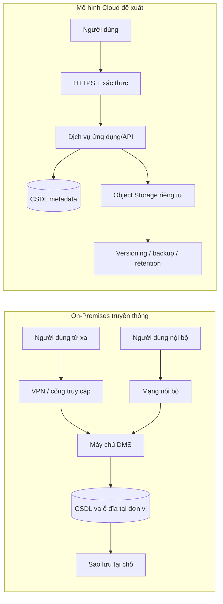

# Phân tích điểm nghẽn On-Premises và đối chiếu mô hình Cloud cho DMS

> **Người thực hiện:** Vũ Hải Đăng  
> **Phạm vi:** 5 điểm nghẽn của hạ tầng On-Premises; bảng đối chiếu 8 tiêu chí giữa mô hình truyền thống và Cloud.  
> **Lưu ý về hiện trạng:** Mã nguồn DMS đang khảo sát là ứng dụng Flutter dùng SQLite cục bộ; repository không chứng minh đã có máy chủ On-Premises triển khai. Phân tích On-Premises dưới đây mô tả mô hình hạ tầng truyền thống giả định khi DMS được vận hành tập trung tại đơn vị, không khẳng định đó là hạ tầng đang chạy của project.

## 1. Bối cảnh và giả định

Trong mô hình On-Premises, đơn vị tự đầu tư và vận hành máy chủ ứng dụng, cơ sở dữ liệu, vùng lưu trữ file, mạng nội bộ, sao lưu và thiết bị bảo mật tại cơ sở của mình. Người dùng bên ngoài thường phải kết nối VPN hoặc đi qua cổng truy cập được bảo vệ.

Khi đối chiếu với Cloud, cần so sánh cùng một workload và cùng mức dịch vụ. Cloud không mặc nhiên nhanh hơn, rẻ hơn hay an toàn hơn: kết quả phụ thuộc thiết kế, cấu hình quyền, vùng triển khai, tải truy cập và năng lực vận hành.

## 2. Năm điểm nghẽn nghiêm trọng của On-Premises

| STT | Điểm nghẽn | Nguyên nhân thường gặp | Tác động tới DMS | Hướng xử lý khi tích hợp Cloud |
|---:|---|---|---|---|
| 1 | **Giới hạn dung lượng và nghẽn I/O lưu trữ** | Tệp PDF, slide, ảnh và bản scan tăng liên tục; dung lượng đĩa và thông lượng I/O bị giới hạn bởi thiết bị đã mua. Sao lưu đồng thời có thể tranh chấp tài nguyên với truy cập thật. | Upload/download chậm, hết dung lượng bất ngờ, truy vấn hoặc mở tài liệu bị ảnh hưởng; nâng cấp thường cần mua và thay phần cứng. | Tách metadata khỏi nội dung file; dùng object storage có khả năng mở rộng theo nhu cầu, đặt quota/cảnh báo và chính sách vòng đời phù hợp. |
| 2 | **Khó mở rộng, phụ thuộc trần vật lý** | Scale-up cần mua server/đĩa/RAM, lắp đặt và có thể phải dừng dịch vụ; dự báo tải tăng trưởng thường không chính xác. | Khó đáp ứng đợt cao điểm đầu kỳ/cuối kỳ; đầu tư dư gây lãng phí, đầu tư thiếu gây suy giảm hiệu năng. | Mở rộng dịch vụ managed hoặc theo chiều ngang khi kiến trúc hỗ trợ; đặt giới hạn và autoscaling có kiểm soát, theo dõi tải thực tế. |
| 3 | **SPOF và truy cập từ xa phức tạp** | Một máy chủ, switch, nguồn điện hoặc đường truyền có thể trở thành điểm lỗi đơn; VPN/cổng truy cập cần duy trì, cấp quyền và xử lý sự cố. | Hỏng một thành phần có thể làm nhiều người dùng mất truy cập; trải nghiệm từ xa phụ thuộc VPN, băng thông và cấu hình thiết bị. | Thiết kế vùng dự phòng/đa vùng theo yêu cầu; sử dụng truy cập HTTPS có xác thực và phân quyền. Cloud vẫn cần kế hoạch dự phòng, không tự loại bỏ mọi SPOF. |
| 4 | **Rủi ro thảm họa, mất dữ liệu và ransomware** | Sao lưu có thể nằm cùng địa điểm hoặc cùng miền quyền quản trị; lịch backup, kiểm tra restore và bản sao bất biến không đầy đủ. | RPO/RTO cao hoặc không rõ; dữ liệu và bản sao lưu có thể cùng bị mã hóa/xóa, làm gián đoạn hoạt động DMS. | Dùng backup tách biệt, versioning/retention và bản sao bất biến khi phù hợp; giới hạn quyền xóa; kiểm tra restore định kỳ và xác định RPO/RTO mục tiêu. |
| 5 | **CapEx/OpEx và gánh nặng vận hành** | Cần đầu tư trước cho máy chủ, lưu trữ, UPS, mạng, bản quyền và nhân lực; nhóm vận hành chịu trách nhiệm vá lỗi, giám sát, thay thế, an toàn vật lý. | Chi phí khó co giãn theo sử dụng; thời gian của nhân sự bị tiêu tốn vào bảo trì; mua sắm và mở rộng mất thời gian. | Chuyển một phần sang chi phí theo mức dùng dịch vụ; quản lý ngân sách, cảnh báo, quota và lifecycle. Cloud giảm nhu cầu tự quản lý phần cứng nhưng vẫn phát sinh chi phí dịch vụ, truyền dữ liệu và vận hành cấu hình. |

### 2.1 Mô hình hóa luồng truy cập

Sơ đồ mô tả khái niệm để đối chiếu, không đại diện cho cấu hình Cloud đã triển khai của repository.

## 3. Bảng đối chiếu 8 tiêu chí: Truyền thống và Cloud

| Tiêu chí | On-Premises truyền thống | Sau khi tích hợp Cloud | Đánh đổi/cần kiểm soát |
|---|---|---|---|
| **1. Dung lượng lưu trữ** | Bị giới hạn bởi thiết bị tại chỗ; tăng dung lượng cần mua, lắp đặt và dự trù trước. | Object storage có thể tăng theo nhu cầu sử dụng và tách riêng file khỏi metadata. | Phát sinh phí lưu trữ, request và tải dữ liệu; cần quota, lifecycle và cảnh báo ngân sách. |
| **2. Hiệu năng truy cập/I/O** | Phụ thuộc cấu hình đĩa, máy chủ và tải đồng thời tại đơn vị. | Có thể phân phối và mở rộng tài nguyên; CDN có thể hữu ích với nội dung phù hợp và người dùng phân tán. | Không đảm bảo latency thấp hơn trong mọi trường hợp; phụ thuộc mạng, vùng, kích thước file và cấu hình cache. |
| **3. Khả năng mở rộng** | Chủ yếu scale-up phần cứng; thời gian mua sắm và lắp đặt tạo độ trễ. | Dịch vụ managed thường cho phép điều chỉnh dung lượng/tài nguyên linh hoạt hơn. | Autoscaling không phải vô hạn; cần thiết kế giới hạn, theo dõi tải và kiểm soát chi phí. |
| **4. Độ sẵn sàng** | Đơn vị tự thiết kế dự phòng điện, mạng, máy chủ, CSDL và vùng lưu trữ. | Nhà cung cấp có dịch vụ/vùng dự phòng và SLA theo từng sản phẩm, nếu được cấu hình phù hợp. | SLA không thay thế HA ở cấp ứng dụng; lỗi cấu hình, tài khoản hoặc vùng vẫn có thể gây gián đoạn. |
| **5. Truy cập từ xa** | Thường qua VPN, firewall và mạng của đơn vị; việc cấp quyền/vận hành do nội bộ đảm trách. | Có thể truy cập qua HTTPS có xác thực từ nhiều địa điểm, trên nhiều thiết bị được hỗ trợ. | Cần IAM/Authentication, MFA khi phù hợp, kiểm tra quyền từng request và quản lý phiên an toàn. |
| **6. Sao lưu và khôi phục** | Đơn vị tự xây lịch backup, lưu bản sao ngoài site và diễn tập phục hồi. | Có thể tận dụng backup managed, versioning, replication và retention theo dịch vụ. | Những tính năng này cần bật và kiểm tra; phải định nghĩa RPO/RTO, chống xóa nhầm/ransomware và thử restore. |
| **7. Bảo mật và trách nhiệm** | Đơn vị kiểm soát vật lý và toàn bộ ngăn xếp, đồng thời tự vận hành vá lỗi, giám sát và phân quyền. | Nhà cung cấp bảo vệ hạ tầng nền; khách hàng cấu hình danh tính, quyền, dữ liệu, mạng và logging theo mô hình shared responsibility. | Cloud không tự động an toàn; bucket công khai, quyền quá rộng hoặc secret lộ vẫn là rủi ro nghiêm trọng. |
| **8. Chi phí và vận hành** | CapEx ban đầu cao hơn; có chi phí bảo trì, điện, nhân lực, khấu hao và thay thiết bị. | Chi phí dịch vụ phần lớn theo mức dùng; giảm một phần công việc quản lý phần cứng vật lý. | Tổng chi phí phụ thuộc dung lượng, request, egress, backup, compute, logging và nhân lực; phải dự toán theo workload. |

### 3.1 Kết luận so sánh

Cloud phù hợp khi DMS cần lưu trữ file tăng trưởng, truy cập từ xa, phục hồi có kiểm thử và khả năng điều chỉnh theo tải. On-Premises vẫn có thể phù hợp nếu có yêu cầu kiểm soát tại chỗ, ràng buộc kết nối hoặc quy định dữ liệu đặc thù. Trước khi quyết định cần so sánh chi phí tổng sở hữu (TCO), yêu cầu bảo mật/tuân thủ, RPO/RTO và vùng dữ liệu; không nên kết luận chỉ dựa trên giá lưu trữ mỗi GB.

## 4. Trạng thái và giới hạn kết quả

| Đầu việc | Kết quả hiện tại |
|---|---|
| Khảo sát và chỉ ra 5 điểm nghẽn On-Premises | Đã tổng hợp thành bảng nguyên nhân, tác động và hướng xử lý. |
| Trực quan hóa bảng so sánh 8 tiêu chí | Đã lập ma trận đối chiếu On-Premises/Cloud trong báo cáo. |
| Thiết kế slide thuyết trình 11 trang 16:9 | Đã phác thảo storyboard và quy tắc thiết kế; chưa tạo file `.pptx`. |

