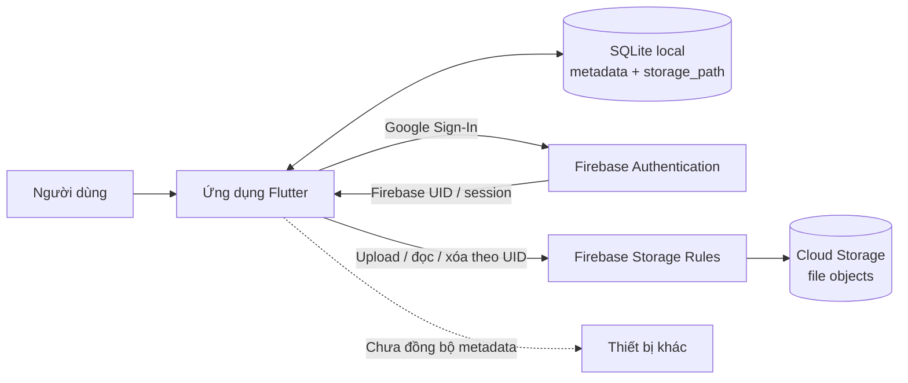
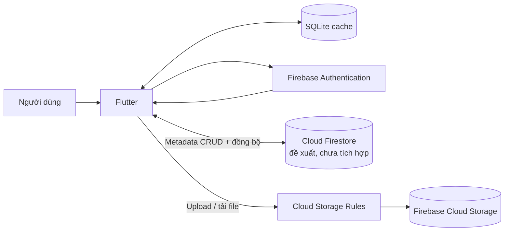

# Phân tích và phương án tích hợp Cloud cho hệ thống Quản lý Tài liệu

> **Dự án:** Study Document Manager (Flutter)
> **Firebase project đã cấu hình trong mã nguồn:** `cashew-study-docs-3afed`
> **Phạm vi:** Phân tích kiến trúc hiện trạng, đánh giá hạn chế, trình bày mô hình Hybrid Cloud và phân biệt rõ phần Firebase đã tích hợp với phần đồng bộ metadata còn là đề xuất.

## Tóm tắt

Ứng dụng Flutter hiện quản lý metadata tài liệu/môn học bằng SQLite cục bộ. Bản tích hợp thực tế đã bổ sung Google Authentication và Firebase Cloud Storage cho file trên Android, iOS và Web. Storage Rules giới hạn đường dẫn theo UID, loại MIME khai báo và dung lượng tối đa 20 MiB. Tuy nhiên, metadata vẫn ở SQLite của từng thiết bị: ứng dụng **chưa đồng bộ danh sách tài liệu giữa các thiết bị**, chưa có Firestore và chưa có Backend/API riêng.

Phương án phù hợp với trạng thái và checklist là **Hybrid Cloud**: giữ Flutter + SQLite làm giao diện và dữ liệu local; dùng Firebase Authentication để xác thực và Cloud Storage để lưu file; nếu cần đồng bộ metadata đa thiết bị, bổ sung Firestore cùng quy tắc bảo mật và quy trình đồng bộ ở giai đoạn tiếp theo. Firebase là dịch vụ Public Cloud; SQLite vẫn là thành phần chạy trên thiết bị. Đây là phương án Firebase nhất quán với phần tích hợp thực hành, không nhầm lẫn với phương án AWS độc lập.

## 1. Thành phần cốt lõi và hiện trạng

| Thành phần | Hiện trạng trong ứng dụng | Nhận xét |
|---|---|---|
| **Frontend** | Flutter/Dart. `lib/pages/` có Dashboard, danh sách, tìm kiếm, chi tiết, form thêm/sửa và trang tài khoản. | Dùng chung cho Android, iOS và Web; hiển thị trạng thái đăng nhập và tiến độ upload. |
| **Backend / nghiệp vụ** | Chưa có server/API riêng. `DocumentService` thực thi kiểm tra và gọi SQLite trong app. Firebase SDK được gọi từ lớp service phía client. | Firebase Authentication và Storage cung cấp dịch vụ managed, nhưng không biến app thành Backend server. Không có Cloud Function xử lý nghiệp vụ riêng. |
| **Database / metadata** | SQLite lưu `subjects`, `documents` cùng thuộc tính tài liệu. `storage_path` được thêm qua migration schema version 2. | Database vẫn cục bộ; cùng tài khoản trên thiết bị khác không tự thấy metadata. Firebase không lưu metadata trong phiên bản hiện tại. |
| **File Storage** | Firebase Cloud Storage lưu nội dung file theo `users/{uid}/documents/{documentId}/{fileId}/{fileName}`. SQLite chỉ giữ `storage_path`, không giữ byte file hay Download URL. | Upload trực tiếp từ app, tối đa 20 MiB, hỗ trợ PDF/Office/TXT; đọc/xóa cần đăng nhập đúng UID theo Rules. |
| **Danh tính** | Firebase Authentication với Google Sign-In trên Android, iOS và Web. | SHA-1 Android, cấu hình iOS và Authorized Domain Web phải khớp Firebase Console. |

Các điểm triển khai chính: `lib/main.dart` khởi tạo Firebase trên Android/iOS/Web; `lib/struct/google_auth_service.dart` xử lý đăng nhập; `lib/struct/firebase_storage_service.dart` xử lý upload/download URL/xóa; `lib/database/app_database.dart` quản lý SQLite và migration; `storage.rules` giới hạn truy cập Storage.

## 2. Hạn chế của mô hình cục bộ/truyền thống

Các điểm dưới đây mô tả mô hình trước khi bổ sung Firebase và các giới hạn vẫn còn trong bản hiện tại:

1. **Dữ liệu phân tán theo thiết bị:** SQLite không tự đồng bộ. Hỏng/mất thiết bị có thể làm mất metadata nếu không sao lưu.
2. **Không có Backend/API dùng chung:** kiểm tra nghiệp vụ chạy ở client; chưa có service trung tâm để phân quyền metadata, audit hoặc áp dụng chính sách cho mọi client.
3. **Không có quản lý file tập trung trước tích hợp:** chỉ lưu `fileUrl` tự nhập; liên kết bên ngoài có thể hết hạn, đổi quyền hoặc bị xóa.
4. **Giới hạn cộng tác và mở rộng:** không có dữ liệu metadata trung tâm để hỗ trợ nhiều thiết bị, nhiều người dùng, chia sẻ hoặc báo cáo.
5. **Sao lưu/vận hành chưa tập trung:** mã ứng dụng không triển khai backup/restore metadata, giám sát Backend hay lịch sử truy cập tập trung.
6. **Web có giới hạn độ bền:** nếu SQLite WASM không khởi động được, hiện có In-Memory fallback; dữ liệu fallback chỉ tồn tại trong phiên.
7. **Giới hạn còn lại sau tích hợp Firebase:** file đã ở Cloud và được bảo vệ bằng Rules, nhưng metadata vẫn ở SQLite local. Vì thế đăng nhập trên thiết bị khác không đồng nghĩa tài liệu tự xuất hiện ở đó.

## 3. Mô hình Cloud và dịch vụ được lựa chọn

### Mô hình: Hybrid Cloud

- **Local:** ứng dụng Flutter và SQLite, tiếp tục cung cấp CRUD, tìm kiếm và hiển thị metadata cục bộ.
- **Public Cloud:** Firebase Authentication (Google) cho danh tính và Firebase Cloud Storage cho tệp.
- **Giai đoạn mở rộng:** Cloud Firestore có thể lưu metadata dùng chung; cần bổ sung thiết kế đồng bộ, xử lý xung đột, migration dữ liệu và Firestore Security Rules trước khi triển khai. Firestore **chưa được tích hợp trong code hiện tại**.

Hybrid phù hợp vì tận dụng dữ liệu local hiện có nhưng bổ sung danh tính và kho file Cloud. Đây là kiến trúc lai local + Public Cloud; không có máy chủ Private Cloud/on-premises riêng.

### Dịch vụ và vai trò

| Dịch vụ | Trạng thái | Vai trò / lưu ý |
|---|---|---|
| **Firebase Authentication** | Đã tích hợp trong app; cần bật Google provider ở Console | Đăng nhập, cung cấp UID dùng để phân vùng file. |
| **Cloud Storage for Firebase** | Đã tích hợp trong app; bucket và Rules cần được thiết lập/deploy trên Console | Lưu byte tài liệu. Bucket không được coi là công khai; quyền dựa trên Firebase Auth + Storage Rules. |
| **Cloud Firestore** | Đề xuất giai đoạn tiếp theo, chưa nằm trong app | Lưu metadata dùng chung nếu mục tiêu là đa thiết bị; cần Rules theo owner/nhóm và cơ chế đồng bộ rõ ràng. |
| **Firebase App Check** | Khuyến nghị đánh giá trước khi phát hành thật | Giúp giảm client không hợp lệ; không thay thế Authentication hoặc Security Rules. |
| **Cloud Monitoring/Budget alerts** | Thiết lập vận hành ngoài mã nguồn | Theo dõi usage/chi phí; budget alert không phải hạn mức cứng ngăn phát sinh phí. |

> Firebase Storage Rules hiện kiểm tra kích thước và MIME type do request khai báo. MIME này không chứng minh byte file thực sự là định dạng đó; nếu nhận file từ nguồn không tin cậy hoặc triển khai công khai cần kiểm tra nội dung ở backend/quy trình tin cậy và cân nhắc quét malware.

## 4. Sơ đồ kiến trúc và luồng dữ liệu

### 4.1 Kiến trúc hiện thực trong prototype

### 4.2 Kiến trúc đích nếu cần metadata đa thiết bị

Kiến trúc đích không được hiểu là đã triển khai. Trước khi bật Firestore cần xác định owner/nhóm, quy tắc quyền, chiến lược merge/xung đột offline, schema và migration; tránh ghi song song hai nguồn mà không có quy tắc nhất quán.

### 4.3 Luồng dữ liệu đã có

1. Người dùng đăng nhập Google; Firebase Authentication cấp phiên và UID.
2. Khi tạo/sửa tài liệu và chọn tệp, app kiểm tra trạng thái đăng nhập, loại file và giới hạn 20 MiB.
3. App tải bytes trực tiếp lên Storage tại đường dẫn UID-scoped; Rules cho phép chủ sở hữu đã đăng nhập và từ chối loại MIME/kích thước không được phép.
4. App lưu `storage_path` vào SQLite cùng metadata. Download URL chỉ được lấy khi mở file, không lưu vào DB.
5. Khi xóa tài liệu, app xóa object Cloud trước, sau đó mới xóa metadata SQLite. Nếu Storage từ chối/xảy ra lỗi, metadata được giữ để tránh mất tham chiếu tới file còn tồn tại.

### 4.4 Luồng dữ liệu đề xuất cho Firestore

1. Sau khi xác thực, app đọc/ghi document metadata trong Firestore với `ownerUid` lấy từ phiên, không tin UID do người dùng nhập.
2. Firestore Security Rules giới hạn đọc/ghi theo owner hoặc quyền chia sẻ đã thiết kế; client không được truy cập toàn bộ collection.
3. SQLite tiếp tục làm cache local. Xác định rõ dữ liệu offline, xử lý xung đột, xóa, đăng xuất và chuyển thiết bị trước khi coi đây là đồng bộ production.

## 5. Tác động bảo mật, chi phí và hiệu suất

### So sánh trước và sau

| Tiêu chí | Trước tích hợp | Prototype hiện tại | Đích mở rộng nếu dùng Firestore |
|---|---|---|---|
| Metadata | SQLite riêng trên thiết bị | Vẫn SQLite riêng trên thiết bị | Firestore làm metadata dùng chung; SQLite có thể làm cache |
| File | Chỉ URL/đường dẫn do người dùng nhập | Firebase Storage, giới hạn 20 MiB và UID Rules | Giữ Storage, bổ sung metadata/object lifecycle |
| Đăng nhập | Chưa có | Google qua Firebase Auth (Console phải bật) | Firebase Auth, thêm chính sách tài khoản/nhóm |
| Truy cập đa thiết bị | Không đồng bộ | File Cloud gắn UID; metadata không đồng bộ | Có metadata chung sau khi thiết kế và triển khai Firestore |
| Vận hành | Chủ yếu local | Phụ thuộc mạng/bucket/Rules cho thao tác file | Thêm chi phí reads/writes, đồng bộ và kiểm thử xung đột |

### Bảo mật

- **Đã có:** Firebase Auth; Storage Rules yêu cầu UID chủ sở hữu trên đường dẫn; giới hạn dung lượng và tập MIME; không lưu Download URL có token vào SQLite.
- **Cần lưu ý:** file tải bằng `getDownloadURL()` có URL token dạng bearer. Không chia sẻ URL ra ngoài; người có URL có thể truy cập cho tới khi token bị thu hồi/thay đổi theo cơ chế Firebase.
- **Giới hạn kiểm tra file:** extension/MIME khai báo ở client không xác thực nội dung thật. Không dùng giới hạn này thay cho quét file trong môi trường rủi ro cao.
- **Cần làm trước release:** bật provider, deploy Rules, thêm SHA-1, giới hạn quyền thành viên, bật App Check nếu phù hợp, rà soát logging và thử truy cập bằng tài khoản khác.
- **Firestore:** nếu thêm, phải viết và kiểm thử Firestore Rules riêng; Storage Rules không bảo vệ Firestore.

### Chi phí

- Firebase usage và yêu cầu billing thay đổi theo loại bucket, region và chính sách hiện hành của Google. Kiểm tra yêu cầu gói hiển thị trong Firebase Console trước khi tạo bucket; không xem con số/điều kiện trong hướng dẫn cũ là cam kết giá.
- Các nguồn chi phí chính: dung lượng lưu trữ, upload/download, thao tác Storage, Firestore reads/writes (nếu bật), network egress và dịch vụ phụ trợ.
- Trước demo dùng file nhỏ/dữ liệu giả, xem usage/billing trong Console và tạo budget alert. Budget alert chỉ cảnh báo, không tự chặn chi tiêu.
- Không thể đưa ước tính tiền đáng tin nếu chưa biết số người dùng, dung lượng, lượt xem/tải, region và thời gian lưu.

### Hiệu suất

- Tệp được truyền trực tiếp từ app tới Cloud Storage thay vì qua server ứng dụng; progress được hiển thị.
- Mở/xóa file cần mạng và quyền hợp lệ. CRUD/tìm kiếm metadata vẫn chạy trên SQLite local.
- Firebase Storage giải quyết nơi lưu file và truy cập cloud, nhưng không tự cung cấp đồng bộ metadata, offline sync hay backup SQLite.
- Kết nối yếu làm chậm upload/download; giới hạn kích thước, báo lỗi, progress và thử nghiệm trên mạng thực tế là cần thiết.

## 6. Cấu hình nhóm và kiểm thử vận hành

1. Chủ project cấp quyền cần thiết cho thành viên trong Google/Firebase Cloud project; không chia sẻ mật khẩu tài khoản cá nhân.
2. Bật Authentication → Google; tạo bucket sau khi xác nhận region, billing và cảnh báo ngân sách.
3. Thêm SHA-1 cho Android; kiểm tra iOS URL scheme/client ID; cho phép domain đang dùng cho Web.
4. Chạy `firebase deploy --only storage --project=cashew-study-docs-3afed` từ `study_document_manager/` để áp dụng `storage.rules`.
5. Chạy app trên Android hoặc Chrome: đăng nhập, upload file nhỏ, kiểm tra đường dẫn UID, mở file, xóa file; thử đăng xuất, file không hỗ trợ, file quá 20 MiB và UID khác.
6. Kiểm tra Console để chắc chắn object đã bị xóa. Thử bằng UID khác phải không đọc/xóa được object.
7. Ghi nhận kết quả thử nghiệm thực tế vào biên bản nhóm. Build/test local không xác nhận rằng Google provider, billing, bucket và Rules đã bật trên Firebase Console.

Hướng dẫn thao tác Console chi tiết nằm trong `README.md`. Mã nguồn slide checklist 7 và bản trình chiếu là `SLIDE_FIREBASE_CLOUD.md` và `SLIDE_FIREBASE_CLOUD.pptx`.

## 7. Đối chiếu checklist bài tập

| # | Yêu cầu | Đáp ứng / giới hạn được nêu |
|---|---|---|
| 1 | Phân tích Frontend, Backend, Database, File Storage | Mục 1 phân tích cấu trúc code và nêu rõ chưa có Backend server. |
| 2 | Hạn chế hệ thống truyền thống | Mục 2 phân tích dữ liệu local phân tán, file/link, sao lưu, mở rộng và Web fallback. |
| 3 | Chọn Cloud model và dịch vụ cụ thể | Mục 3 chọn Hybrid + Firebase Auth/Storage; Firestore được đánh dấu là đề xuất, không nói đã tích hợp. |
| 4 | Sơ đồ kiến trúc và luồng dữ liệu | Mục 4 có sơ đồ prototype, sơ đồ đích và các bước dữ liệu. |
| 5 | Bảo mật, chi phí, hiệu suất | Mục 5 đánh giá lợi ích, giới hạn, chi phí theo usage và phụ thuộc mạng. |
| 6 | Firebase Google Sign-In và Storage | Code app có Auth/Storage; các thao tác Console, billing và deploy Rules vẫn cần nhóm thực hiện/ghi nhận. |
| 7 | Slide Firebase và setup tài khoản nhóm | Có bản trình chiếu và source slide; thay placeholder tên nhóm/thành viên trước khi nộp. |

## Kết luận

Prototype đã chứng minh đăng nhập Google và lưu tệp trên Firebase Storage trong kiến trúc Flutter + SQLite local. Không nên tuyên bố metadata đa thiết bị, Firestore, Backend riêng, đồng bộ offline hay kiểm thử Firebase production đã hoàn tất. Phần báo cáo và slide tách rõ những gì đã có khỏi phần mở rộng đề xuất; nhóm cần hoàn tất cấu hình Console và chạy kịch bản demo trước khi khẳng định luồng Firebase thật hoạt động.
