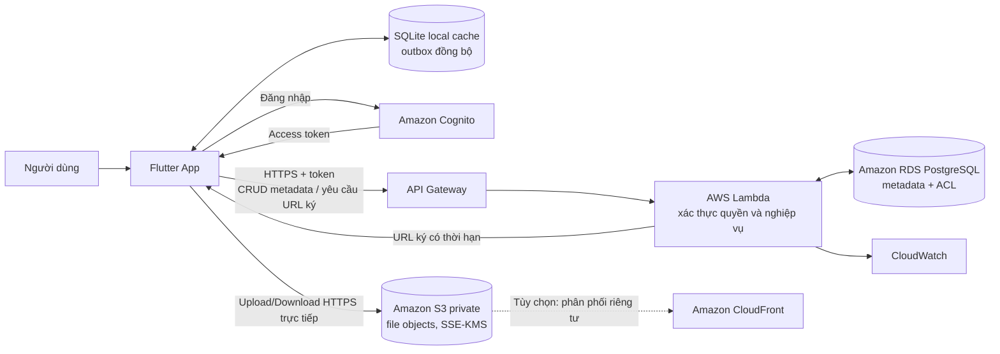

# Phân tích hệ thống Quản lý tài liệu và đề xuất tích hợp Cloud

> **Phạm vi:** Phân tích mã nguồn hiện có trong `study_document_manager/`, sau đó đề xuất kiến trúc Cloud và lộ trình chuyển đổi.  
> **Lưu ý:** Các dịch vụ Cloud trong báo cáo là phương án đề xuất, chưa được cấu hình hoặc triển khai trong ứng dụng hiện tại.

## Tóm tắt

Ứng dụng hiện tại là ứng dụng Flutter/Dart quản lý tài liệu học tập, áp dụng cách phân tách Presentation, Struct/Domain và Data theo phong cách Cashew. Các chức năng cốt lõi gồm quản lý tài liệu và môn học, tìm kiếm/lọc/sắp xếp, theo dõi bài tập, đánh dấu yêu thích và mở liên kết tài liệu. Tầng dữ liệu hiện dùng SQLite cục bộ; trên Web có đường chạy SQLite WASM và cơ chế dự phòng In-Memory. Trường `fileUrl` chỉ lưu một chuỗi đường dẫn/liên kết. Mã nguồn chưa thể hiện dịch vụ Backend/API từ xa, đăng nhập người dùng, tải tệp lên hoặc kho tệp tập trung.

Vì vậy, phương án phù hợp là **Hybrid Cloud**: giữ Flutter cùng SQLite cục bộ để cung cấp cache và khả năng làm việc offline; bổ sung API có xác thực, cơ sở dữ liệu Cloud cho metadata và object storage riêng tư cho nội dung tệp. Cách này tận dụng phần giao diện/nghiệp vụ hiện có mà vẫn tạo được lưu trữ tập trung, truy cập từ nhiều thiết bị và khả năng mở rộng.

## 1. Phân tích các thành phần cốt lõi hiện có

### 1.1 Frontend / Presentation

| Thành phần | Hiện trạng và trách nhiệm |
|---|---|
| Nền tảng UI | Flutter/Dart trong `lib/`, với cấu hình theme sáng/tối và theme theo hệ thống tại `lib/main.dart`. Có cấu hình Web trong `web/` và mã nguồn nền tảng desktop/mobile. |
| Màn hình | `lib/pages/home_page.dart` tổng hợp thống kê, bài tập chưa hoàn thành, tài liệu gần đây; `document_list_page.dart` hiển thị danh sách; `add_edit_document_page.dart` tạo/sửa tài liệu và nhập môn học; `document_detail_page.dart` xem chi tiết và mở liên kết; `document_search_page.dart` phục vụ tìm kiếm. |
| Thành phần dùng lại | `lib/widgets/` có thẻ tài liệu, thanh tìm kiếm, bộ lọc, form field, khung trang và hộp thoại xác nhận xóa. |
| Cập nhật UI | Màn hình chính lắng nghe stream tài liệu/môn học từ Data layer; trạng thái bộ lọc chia sẻ dùng `ValueNotifier` trong `lib/struct/document_global.dart`. |
| Biên tích hợp hiện tại | Form tài liệu nhận đường dẫn/liên kết qua trường văn bản; màn hình chi tiết dùng `url_launcher` để mở URL hoặc đường dẫn tệp. Chưa có giao diện chọn tệp hay tải tệp lên Cloud trong mã nguồn đã khảo sát. |

**Đánh giá:** Tầng UI đã tách khỏi truy cập SQLite ở mức nhất định và có thể giữ lại phần lớn. Khi thêm Cloud, UI cần bổ sung trạng thái upload/download, tiến độ, lỗi mạng, đăng nhập và đồng bộ; không nên gọi SDK lưu trữ Cloud trực tiếp từ mọi màn hình.

### 1.2 Backend / xử lý nghiệp vụ

Ứng dụng **chưa có Backend server/API riêng**. Luồng nghiệp vụ hiện chạy ngay trong ứng dụng:

- `lib/struct/document_service.dart` kiểm tra tiêu đề và URL, gọi CRUD tới biến `database`, đồng thời lọc, sắp xếp và tính thống kê.
- `lib/database/app_database.dart` đóng vai trò DAO/data engine, mở SQLite và cung cấp CRUD, truy vấn cùng broadcast streams.
- `lib/functions.dart` và các widget hỗ trợ điều hướng/thông báo giao diện.

Do đó, `DocumentService` là nghiệp vụ phía client chứ không phải Backend dùng chung. Các quy tắc hiện tại chỉ có hiệu lực đầy đủ ở client; khi nhiều thiết bị hoặc người dùng cùng truy cập, cần chuyển kiểm tra quyền, xác thực và quy tắc dữ liệu quan trọng sang API tin cậy phía server.

### 1.3 Database / metadata

`lib/database/tables.dart` khai báo hai bảng SQLite:

- **`subjects`**: ID, tên, mã, màu, biểu tượng và ngày tạo môn học.
- **`documents`**: ID, tiêu đề, `subject_id`, loại tài liệu, ghi chú, `file_url`, tags, trạng thái, ưu tiên, yêu thích, deadline và thời gian tạo/cập nhật. `subject_id` tham chiếu môn học với `ON DELETE CASCADE`.

`DocumentModel` và `SubjectModel` trong `lib/struct/models/document_models.dart` chuyển đổi dữ liệu qua `toMap`/`fromMap`. Tìm kiếm SQLite hiện dùng `LIKE` trên tiêu đề, ghi chú và tags; bộ lọc hỗ trợ môn học, loại, yêu thích và thứ tự theo thời gian cập nhật. Các tags được lưu thành chuỗi phân tách dấu phẩy.

SQLite được mở trong `AppDatabase.init()`: trên desktop/mobile, file DB nằm trong application documents directory; trên Web, ứng dụng thử SQLite WASM và nếu không khởi tạo được thì fallback sang bộ nhớ. Fallback bộ nhớ làm dữ liệu thay đổi trong phiên không được lưu bền vững sau khi đóng ứng dụng/trang.

### 1.4 File Storage / nội dung tệp

Hiện tại, **chưa có thành phần File Storage thực thụ**:

- `documents.file_url`/`DocumentModel.fileUrl` chỉ lưu chuỗi liên kết hoặc đường dẫn. Dữ liệu mẫu có cả URL HTTPS và một đường dẫn dạng `assets/...`.
- Form nhập/sửa chỉ cập nhật chuỗi này; màn hình chi tiết mở liên kết bằng `url_launcher`.
- Chưa thấy mã chọn tệp, đọc byte, upload/download, kiểm tra quyền tệp, hay lưu nội dung tệp trong SQLite hoặc dịch vụ ngoài.

Vì thế, tài liệu thật đang được lưu ở nơi khác do người dùng cung cấp liên kết; DB chỉ lưu metadata/tham chiếu. Không nên mô tả hệ thống hiện tại như đã có kho tệp cục bộ hoặc Cloud.
### 1.5. Đánh giá tổng hợp mức độ sẵn sàng chuyển đổi Cloud

Mức độ sẵn sàng chuyển đổi Cloud, hay **Cloud-readiness**, được đánh giá dựa trên ba yếu tố chính:

1. Khả năng tái sử dụng các thành phần hiện có.
2. Khối lượng thay đổi cần thực hiện khi tích hợp Cloud.
3. Mức độ phức tạp và rủi ro kỹ thuật trong quá trình chuyển đổi.

#### Bảng đánh giá tổng hợp

| Thành phần | Hiện trạng và khả năng tái sử dụng | Thay đổi cần thực hiện | Mức sẵn sàng |
|---|---|---|:---:|
| **Frontend Flutter** | Có thể giữ lại phần lớn màn hình, widget, điều hướng, bộ lọc và giao diện hiện tại. Flutter có khả năng triển khai đa nền tảng trên Web, Android và Desktop. | Bổ sung màn hình đăng nhập, quản lý trạng thái xác thực, chọn tệp, hiển thị tiến trình upload/download, thông báo lỗi mạng và trạng thái đồng bộ. | **Cao** |
| **Tầng nghiệp vụ `DocumentService`** | Có thể tái sử dụng các quy tắc kiểm tra dữ liệu, lọc, sắp xếp và thống kê tài liệu. | Tách Repository khỏi SQLite singleton; bổ sung Local Repository, Remote Repository, Sync Repository và cơ chế xử lý lỗi mạng. | **Trung bình – Cao** |
| **Metadata Database SQLite** | Có thể tiếp tục sử dụng làm Local Cache, hỗ trợ tải dữ liệu nhanh và làm việc ngoại tuyến. | Bổ sung các trường `ownerId`, `cloudPath`, `downloadUrl`, `syncStatus`, `checksum`, `version`, `updatedAt`, `isDeleted` và xây dựng cơ chế migration. | **Trung bình** |
| **File Storage** | Trường `fileUrl` hiện tại có thể được chuyển thành tham chiếu đến tệp trên Cloud. | Xây dựng chức năng chọn tệp, upload, download, hiển thị tiến trình, kiểm tra kích thước, định dạng tệp và phân quyền truy cập. | **Trung bình** |
| **Xác thực và phân quyền** | Source hiện tại chưa có chức năng đăng nhập, nhận dạng người dùng và kiểm soát quyền sở hữu tài liệu. | Tích hợp Firebase Authentication, Google Sign-In và liên kết tài liệu với Firebase UID của người sở hữu. | **Thấp** |
| **Đồng bộ đa thiết bị** | Chưa có cơ chế đồng bộ giữa nhiều thiết bị hoặc nhiều phiên đăng nhập. | Xây dựng hàng đợi thay đổi, cơ chế retry, phát hiện xung đột, quản lý phiên bản và chính sách giải quyết xung đột. | **Thấp – Trung bình** |

#### Phân tích kết quả

##### a. Frontend Flutter

Frontend là thành phần có mức sẵn sàng cao nhất. Các màn hình quản lý tài liệu, tìm kiếm, lọc, thêm, sửa và xem chi tiết có thể tiếp tục được sử dụng khi tích hợp Cloud.

Thay đổi chủ yếu tập trung vào việc bổ sung:

- Màn hình đăng nhập bằng Google.
- Trạng thái người dùng đang đăng nhập.
- Chức năng chọn tệp từ thiết bị.
- Thanh tiến trình upload và download.
- Thông báo khi mất kết nối mạng.
- Trạng thái tài liệu đã đồng bộ hoặc đang chờ đồng bộ.

Frontend không nên gọi trực tiếp Firebase Storage tại nhiều widget khác nhau. Các thao tác Cloud nên được đóng gói trong Service hoặc Repository riêng để bảo đảm khả năng bảo trì và kiểm thử.

##### b. Tầng nghiệp vụ

`DocumentService` hiện thực hiện kiểm tra dữ liệu, lọc, sắp xếp, thống kê và gọi trực tiếp đến database cục bộ. Phần logic này có thể được tái sử dụng, nhưng cần giảm sự phụ thuộc trực tiếp vào SQLite.

Kiến trúc đề xuất gồm:

```text
Presentation Layer
        │
        ▼
Use Case / Document Service
        │
        ▼
Document Repository
   ┌────┴─────┐
   ▼          ▼
Local       Remote
Repository  Repository
   │          │
SQLite       Cloud
```

Việc bổ sung Repository interface giúp ứng dụng có thể chuyển đổi giữa dữ liệu local và Cloud mà không phải viết lại toàn bộ giao diện.

##### c. Metadata Database

SQLite vẫn phù hợp để:

- Lưu bộ nhớ đệm cục bộ.
- Tải nhanh danh sách tài liệu.
- Hỗ trợ chế độ ngoại tuyến.
- Lưu hàng đợi thay đổi chưa đồng bộ.
- Giảm số lần truy vấn Cloud không cần thiết.

Tuy nhiên, metadata cần được mở rộng để hỗ trợ đồng bộ:

| Trường đề xuất | Mục đích |
|---|---|
| `ownerId` | Lưu Firebase UID của chủ sở hữu tài liệu |
| `cloudPath` | Lưu đường dẫn của tệp trên Cloud Storage |
| `downloadUrl` | Lưu URL tải xuống khi cần thiết |
| `syncStatus` | Xác định trạng thái đã đồng bộ, đang chờ hoặc bị lỗi |
| `checksum` | Kiểm tra tính toàn vẹn của tệp |
| `version` | Hỗ trợ phát hiện và giải quyết xung đột |
| `updatedAt` | So sánh thời điểm cập nhật giữa local và Cloud |
| `isDeleted` | Hỗ trợ xóa mềm và đồng bộ thao tác xóa |

##### d. File Storage

Ứng dụng hiện chưa có hệ thống quản lý nội dung tệp hoàn chỉnh. Trường `fileUrl` mới chỉ lưu chuỗi URL hoặc đường dẫn do người dùng nhập.

Khi tích hợp Cloud, File Storage cần hỗ trợ:

- Chọn tệp PDF, DOCX, PPTX hoặc hình ảnh.
- Kiểm tra loại và kích thước tệp.
- Upload tệp lên Cloud Storage.
- Hiển thị phần trăm tiến trình.
- Dừng hoặc thử lại khi upload thất bại.
- Download hoặc mở tệp.
- Xóa tệp theo quyền của người sở hữu.
- Kiểm tra checksum khi cần thiết.

Cấu trúc lưu trữ đề xuất:

```text
users/
└── {uid}/
    └── documents/
        └── {documentId}/
            └── {fileName}
```

##### e. Xác thực và phân quyền

Đây là thành phần chưa tồn tại trong source hiện tại. Ứng dụng cần bổ sung Firebase Authentication và Google Sign-In để xác định người đang sử dụng hệ thống.

Sau khi đăng nhập, Firebase cung cấp UID của người dùng. UID này được sử dụng để:

- Gắn tài liệu với chủ sở hữu.
- Phân chia thư mục trên Cloud Storage.
- Kiểm tra quyền đọc, ghi và xóa.
- Hạn chế người dùng truy cập tài liệu không thuộc quyền sở hữu.
- Ghi nhật ký thao tác khi cần thiết.

Việc kiểm tra quyền không nên chỉ thực hiện tại giao diện. Quyền truy cập thực tế phải được bảo vệ bằng Firebase Security Rules hoặc Backend đáng tin cậy.

##### f. Đồng bộ đa thiết bị

Đồng bộ đa thiết bị là thành phần phức tạp vì phải xử lý trường hợp cùng một tài liệu được thay đổi trên nhiều thiết bị.

Cơ chế đề xuất gồm:

1. Lưu thay đổi tại SQLite.
2. Đánh dấu bản ghi ở trạng thái chờ đồng bộ.
3. Đưa thao tác vào hàng đợi cục bộ.
4. Gửi thay đổi lên Cloud khi có mạng.
5. So sánh `version` và `updatedAt`.
6. Phát hiện thay đổi xung đột.
7. Áp dụng chính sách giải quyết xung đột.
8. Cập nhật lại Local Cache sau khi đồng bộ thành công.

#### Ma trận ưu tiên chuyển đổi

| Mức ưu tiên | Thành phần | Lý do |
|:---:|---|---|
| **1** | Xác thực và phân quyền | Là nền tảng để xác định chủ sở hữu và bảo vệ tài liệu |
| **2** | File Storage | Giải quyết nhu cầu lưu trữ tập trung và truy cập từ xa |
| **3** | Metadata Database | Liên kết metadata local với người dùng và tệp Cloud |
| **4** | Frontend | Bổ sung màn hình đăng nhập, tiến trình và chỉ báo đồng bộ |
| **5** | Đồng bộ đa thiết bị | Thực hiện sau khi xác thực và lưu trữ Cloud hoạt động ổn định |

> **Lưu ý:** Thứ tự trên là phương án triển khai do nhóm đề xuất, không phải thứ hạng cố định của các nền tảng Cloud.

#### Kết luận Cloud-readiness

Frontend Flutter và phần lớn logic nghiệp vụ có khả năng tái sử dụng cao. SQLite có thể tiếp tục được sử dụng làm Local Cache để hỗ trợ tốc độ truy cập và chế độ ngoại tuyến.

Các thành phần cần đầu tư xây dựng nhiều nhất gồm:

- Xác thực người dùng.
- Phân quyền theo chủ sở hữu.
- Lưu nội dung tệp trên Cloud.
- Đồng bộ dữ liệu đa thiết bị.
- Phát hiện và xử lý xung đột.

Tổng thể, ứng dụng có mức sẵn sàng chuyển đổi Cloud ở mức **trung bình đến cao**. Phương án phù hợp là chuyển đổi theo từng giai đoạn, giữ lại Flutter và SQLite, đồng thời bổ sung Firebase Authentication, Cloud Storage và cơ chế đồng bộ.
## 2. Các điểm nghẽn của mô hình truyền thống hiện tại

Ở phạm vi mã nguồn này, “truyền thống” là ứng dụng và DB chạy cục bộ trên thiết bị, không phải một server on-premises đã được triển khai riêng. Các hạn chế quan sát được:

1. **Dữ liệu phân tán theo thiết bị:** Mỗi bản cài có DB riêng. Sửa trên một thiết bị không tự xuất hiện trên thiết bị khác; đổi/mất thiết bị có nguy cơ mất dữ liệu nếu chưa sao lưu.
2. **Không có chia sẻ và phân quyền tập trung:** Chưa có tài khoản, danh tính, vai trò, owner hay API để kiểm soát truy cập nhiều người dùng. Một đường dẫn file công khai/được chia sẻ ngoài ứng dụng không được bảo vệ bởi ứng dụng.
3. **Không quản lý tập trung nội dung tệp:** DB chỉ có `file_url`; ứng dụng không cung cấp upload/download, quota, phiên bản tệp hoặc chính sách vòng đời. Các URL ngoài có thể hết hạn, đổi quyền hoặc bị xóa mà DB không biết.
4. **Giới hạn khả năng mở rộng và cộng tác:** SQLite đơn thiết bị đáp ứng tốt ứng dụng cá nhân nhỏ, nhưng không phải nguồn dữ liệu trung tâm cho nhiều người dùng đồng thời, đồng bộ hoặc báo cáo tổ chức.
5. **Tìm kiếm và vận hành phụ thuộc thiết bị:** Truy vấn chỉ dựa trên SQLite/in-memory; không có index tìm kiếm tập trung, API quản trị, giám sát dịch vụ hoặc quy trình phục hồi dữ liệu tập trung.
6. **Rủi ro riêng của Web fallback:** Nếu Web không mở được SQLite WASM, fallback lưu dữ liệu trong RAM; dữ liệu phiên không đảm bảo tồn tại qua lần mở sau. Đây là suy giảm độ bền dữ liệu đáng lưu ý.
7. **Bảo mật và sao lưu chưa được quản lý ở tầng dịch vụ:** Trong mã nguồn hiện tại chưa thấy đăng nhập, mã hóa DB do ứng dụng quản lý, chính sách backup/restore, audit log hoặc kiểm soát truy cập đối với file. Điều đó không khẳng định thiết bị không có biện pháp hệ điều hành, mà chỉ có nghĩa ứng dụng chưa thể hiện các khả năng này.

## 3. Mô hình và dịch vụ Cloud được lựa chọn

### 3.1 Lựa chọn: Hybrid Cloud

Chọn **Hybrid Cloud** thay vì chuyển toàn bộ ứng dụng sang Cloud hoặc chỉ dùng hạ tầng tại chỗ:

- **Phần local:** Flutter UI, SQLite cache/offline và hàng đợi thay đổi chưa đồng bộ.
- **Phần Cloud:** API, xác thực, metadata dùng chung và lưu nội dung file tập trung.
- **Lý do:** Tận dụng các màn hình, model và nghiệp vụ client hiện có; hỗ trợ làm việc khi mạng chập chờn; đồng thời giải quyết nhu cầu đồng bộ, backup và truy cập từ xa. Public Cloud được dùng cho dịch vụ managed; ứng dụng vẫn giữ thành phần local. Phương án này không yêu cầu tự dựng Private Cloud.

### 3.2 Dịch vụ AWS đề xuất

| Nhu cầu | Dịch vụ đề xuất | Vai trò |
|---|---|---|
| Xác thực | **Amazon Cognito User Pools** | Đăng ký/đăng nhập, phát token; API xác minh danh tính. Nếu trường học có SSO, có thể tích hợp liên kết danh tính ở giai đoạn sau. |
| API Backend | **Amazon API Gateway + AWS Lambda** | Cung cấp HTTPS endpoints cho CRUD, tìm kiếm, xin URL upload/download có thời hạn và kiểm tra quyền. Lambda thực thi quy tắc phía server; không nhúng thông tin xác thực AWS trong ứng dụng Flutter. |
| Cơ sở dữ liệu | **Amazon RDS for PostgreSQL** | Lưu subjects, documents, owner/ACL, S3 object key, checksum, kích thước, MIME type và phiên bản đồng bộ. Mô hình quan hệ gần với schema SQLite hiện có. |
| Lưu tệp | **Amazon S3 private bucket** | Lưu byte của tài liệu tách khỏi DB metadata; bật Block Public Access, mã hóa SSE-KMS, versioning và lifecycle phù hợp. |
| Phân phối (tùy chọn) | **Amazon CloudFront** | Tăng tốc tải tệp ở nhiều khu vực nếu có nhu cầu; chỉ dùng với cơ chế truy cập riêng tư phù hợp như URL/cookie đã ký, không mở bucket công khai. |
| Giám sát và khóa | **Amazon CloudWatch + AWS KMS** | Theo dõi lỗi/độ trễ API, cảnh báo và quản lý khóa mã hóa. Không ghi token hay URL ký có thể truy cập tệp vào log. |

**Mô hình lưu dữ liệu đề xuất:** PostgreSQL lưu metadata và object key, không lưu nội dung file dạng BLOB. S3 giữ file. Ví dụ một document có `id`, `owner_id`, `subject_id`, metadata, `object_key`, `content_type`, `size_bytes`, `checksum`, `version` và timestamps. Mọi bản ghi và object key đều phải gắn với phạm vi người dùng/nhóm được cấp quyền.
### 3.3. So sánh Amazon S3, Google Cloud Storage và Azure Blob Storage

Amazon S3, Google Cloud Storage và Azure Blob Storage đều cung cấp mô hình **Object Storage**, phù hợp để lưu trữ các tệp PDF, DOCX, PPTX, hình ảnh và các dạng dữ liệu nhị phân khác.

Metadata của tài liệu nên được lưu trong database riêng. Object Storage chỉ lưu nội dung tệp và các thuộc tính kỹ thuật liên quan.

#### Bảng so sánh tổng hợp

| Tiêu chí | Amazon S3 | Google Cloud Storage / Firebase Storage | Azure Blob Storage |
|---|---|---|---|
| **Nhà cung cấp** | Amazon Web Services | Google Cloud và Firebase | Microsoft Azure |
| **Loại dịch vụ** | Object Storage | Object Storage | Object Storage |
| **Tích hợp với Flutter** | Thông qua REST API, SDK hoặc Backend cấp Pre-signed URL | Tích hợp thuận lợi qua FlutterFire `firebase_storage` | Thông qua REST API, SDK hoặc Backend cấp SAS |
| **Xác thực** | IAM, Cognito, STS | Firebase Authentication, Google Cloud IAM | Microsoft Entra ID, Azure RBAC |
| **Phân quyền tệp** | IAM Policy, Bucket Policy và quyền theo object | Firebase Security Rules có thể kiểm tra UID | Role-Based Access Control và SAS |
| **Upload trực tiếp** | Pre-signed PUT hoặc POST URL | Firebase Storage `UploadTask` | Shared Access Signature URL |
| **Theo dõi tiến trình** | Theo dõi qua HTTP client hoặc SDK | Có `TaskSnapshot` và trạng thái tiến trình | Theo dõi qua HTTP client hoặc SDK |
| **Quản lý phiên bản** | S3 Versioning | Object Versioning | Blob Versioning |
| **Quản lý vòng đời** | S3 Lifecycle Rules | Object Lifecycle Management | Lifecycle Management Policy |
| **Xử lý sự kiện** | S3 Event, SQS, Lambda | Eventarc, Cloud Functions | Event Grid, Azure Functions |
| **Tích hợp CDN** | Amazon CloudFront | Cloud CDN hoặc Firebase Hosting tùy kiến trúc | Azure Front Door hoặc Azure CDN |
| **Điểm mạnh** | Hệ sinh thái AWS lớn, IAM chi tiết, phù hợp Backend độc lập | Phù hợp Flutter, hỗ trợ Firebase Authentication và Security Rules | Phù hợp tổ chức đang sử dụng hệ sinh thái Microsoft |
| **Điểm cần lưu ý** | Cấu hình IAM và URL ký có độ phức tạp nhất định | Security Rules và cấu trúc đường dẫn phải được kiểm thử kỹ | SAS cần được giới hạn chặt về quyền và thời hạn |
| **Mức phù hợp với bài tập** | Cao cho kiến trúc AWS hoàn chỉnh | **Rất cao cho prototype Flutter** | Trung bình nếu nhóm chưa dùng Azure |

### 3.4. Phân tích từng nền tảng

#### a. Amazon S3

Amazon S3 phù hợp với hệ thống có Backend độc lập và yêu cầu kiểm soát quyền truy cập chi tiết.

**Ưu điểm:**

- Kết hợp tốt với Amazon Cognito, API Gateway và AWS Lambda.
- Hỗ trợ Pre-signed URL để upload và download trực tiếp.
- Hỗ trợ versioning và lifecycle.
- Có thể tích hợp với SQS, Lambda và CloudFront.
- Phù hợp với kiến trúc Backend mở rộng.

**Hạn chế trong phạm vi bài tập:**

- IAM và Bucket Policy cần được cấu hình cẩn thận.
- Không được đưa AWS Access Key vào ứng dụng Flutter.
- Thường cần Backend để kiểm tra quyền và cấp URL có thời hạn.
- Khối lượng cấu hình lớn hơn Firebase đối với prototype sinh viên.

#### b. Google Cloud Storage và Firebase Storage

Cloud Storage for Firebase sử dụng hạ tầng Google Cloud Storage và tích hợp trực tiếp với Firebase Authentication.

**Ưu điểm:**

- Có plugin FlutterFire chính thức.
- Dễ kết hợp với Google Sign-In.
- Security Rules có thể kiểm tra Firebase UID.
- Hỗ trợ upload theo tiến trình.
- Phù hợp cho Web và Android.
- Giảm khối lượng xây dựng Backend trong giai đoạn thử nghiệm.

**Hạn chế:**

- Security Rules phải được thiết kế và kiểm thử kỹ.
- Cần bảo đảm metadata và nội dung tệp được cập nhật nhất quán.
- Không nên sử dụng Download URL làm cơ chế phân quyền duy nhất.
- Cần kiểm tra loại, dung lượng và tên tệp trước khi upload.

#### c. Azure Blob Storage

Azure Blob Storage phù hợp với hệ thống sử dụng Microsoft Azure và Microsoft Entra ID.

**Ưu điểm:**

- Tích hợp tốt với Microsoft Entra ID.
- Có Azure RBAC và Shared Access Signature.
- Hỗ trợ blob versioning và lifecycle.
- Phù hợp với tổ chức đang sử dụng sản phẩm Microsoft.

**Hạn chế trong phạm vi bài tập:**

- Flutter thường cần gọi REST API hoặc thông qua Backend.
- SAS cần giới hạn rõ quyền, tài nguyên và thời gian tồn tại.
- Không tích hợp trực tiếp với Firebase Authentication.
- Nhóm chưa có thành phần Azure khác để tận dụng hệ sinh thái.

### 3.5. Lựa chọn dịch vụ cho phạm vi bài tập

Nếu xây dựng hệ thống Backend hoàn chỉnh theo kiến trúc mục tiêu, Amazon S3 là lựa chọn phù hợp khi kết hợp với:

```text
Amazon Cognito
      │
      ▼
API Gateway
      │
      ▼
AWS Lambda
   ┌──┴─────┐
   ▼        ▼
Amazon RDS  Amazon S3
```

Tuy nhiên, đối với bản thử nghiệm của nhóm, **Cloud Storage for Firebase** phù hợp hơn vì:

1. Ứng dụng được phát triển bằng Flutter.
2. Nhóm đồng thời tích hợp Firebase Authentication.
3. Authentication và Storage sử dụng chung Firebase UID.
4. FlutterFire cung cấp plugin cho cả xác thực và lưu trữ.
5. Security Rules có thể giới hạn quyền truy cập theo người sở hữu.
6. Nhóm có thể chứng minh luồng Cloud mà chưa cần triển khai Backend AWS hoàn chỉnh.

### 3.6. Phương án thống nhất

Nhóm thực hiện theo hai cấp độ:

#### Kiến trúc mục tiêu

Hybrid Cloud gồm:

- Flutter Client.
- SQLite Local Cache.
- Backend API.
- Metadata Database tập trung.
- Object Storage riêng tư.
- Cơ chế xác thực và phân quyền.
- Cơ chế đồng bộ ngoại tuyến.

#### Bản thử nghiệm trong phạm vi bài tập

Firebase gồm:

- Firebase Authentication.
- Google Sign-In.
- Cloud Storage for Firebase.
- Firebase Security Rules.
- SQLite Local Cache.
- Auth State và Login Page trên Flutter.

#### Cấu trúc lưu trữ đề xuất

```text
users/
└── {uid}/
    └── documents/
        └── {documentId}/
            └── {fileName}
```

Trong đó:

| Thành phần | Ý nghĩa |
|---|---|
| `{uid}` | Định danh người dùng do Firebase Authentication cấp |
| `{documentId}` | Định danh duy nhất của tài liệu |
| `{fileName}` | Tên tệp đã được chuẩn hóa |
| Database | Lưu metadata, trạng thái đồng bộ và đường dẫn Cloud |
| Cloud Storage | Lưu nội dung nhị phân của tài liệu |

Download URL không nên được coi là cơ chế phân quyền duy nhất. Quyền truy cập phải được kiểm tra bởi Firebase Security Rules hoặc Backend tin cậy.
## 4. Kiến trúc tích hợp và luồng dữ liệu

### 4.1 Sơ đồ



### 4.2 Luồng tải tài liệu lên

1. Người dùng đăng nhập; Flutter giữ token phiên theo cơ chế bảo mật của nền tảng và tiếp tục dùng SQLite cache để hiển thị dữ liệu đã đồng bộ.
2. Người dùng chọn file (cần bổ sung file picker), nhập metadata và gửi yêu cầu tạo phiên upload qua API kèm access token.
3. API xác thực token, kiểm tra quyền, giới hạn kích thước/loại file, tạo object key không đoán được và trả về URL ký có thời hạn cho một thao tác cụ thể.
4. Flutter tải byte trực tiếp tới S3 qua HTTPS bằng URL ký; file không đi xuyên Lambda/API nên tránh giới hạn payload của API và giảm tải Backend.
5. Ứng dụng gọi API hoàn tất upload. Backend xác minh object tồn tại và metadata cần thiết, sau đó ghi `object_key`, checksum, kích thước và các thuộc tính liên quan vào PostgreSQL.
6. API trả metadata; ứng dụng cập nhật cache SQLite và stream UI. Khi upload lỗi giữa chừng, UI báo lỗi và cho phép thử lại/xóa phiên upload dở theo chính sách.

### 4.3 Luồng mở hoặc tải tài liệu

1. Ứng dụng yêu cầu metadata/tài liệu theo ID qua API.
2. Backend xác thực người dùng và kiểm tra quyền sở hữu/chia sẻ trước khi tạo URL GET ký có thời hạn; không trả bucket/object công khai.
3. Ứng dụng tải/mở file trực tiếp từ S3 qua URL ký hoặc qua CloudFront riêng tư nếu được bật. URL tạm thời không nên được lưu làm `fileUrl` cố định trong SQLite.
4. SQLite giữ metadata cần thiết và có thể giữ trạng thái/đường dẫn cache local theo chính sách. Truy cập file chưa cache khi offline cần thông báo rõ cho người dùng.

### 4.4 Đồng bộ CRUD và tìm kiếm

- Flutter gửi CRUD metadata qua API; Backend kiểm tra đầu vào, quyền và tính toàn vẹn quan hệ trước khi ghi PostgreSQL.
- SQLite lưu bản sao cục bộ để tải màn hình nhanh. Khi offline, ghi thay đổi vào outbox rồi đồng bộ khi mạng trở lại; dùng `updated_at`/`version` để phát hiện xung đột và không âm thầm ghi đè thay đổi mới hơn.
- Tìm kiếm online thực thi ở API/PostgreSQL với phân trang và chỉ trả bản ghi người dùng được phép xem. Tìm kiếm cache offline chỉ giới hạn trên dữ liệu đã đồng bộ.
- Xóa metadata và file cần có chính sách nhất quán, gồm xóa mềm/khôi phục nếu cần, xử lý object S3 và tôn trọng versioning/retention.

### 4.5 Phần cần thay đổi trong mã nguồn

1. Tách hợp đồng truy cập dữ liệu/repository khỏi `AppDatabase` và biến global `database`; hiện `DocumentService` gọi trực tiếp singleton SQLite. Cung cấp triển khai local, remote và đồng bộ thay vì đưa lời gọi AWS vào widget.
2. Bổ sung lớp API client, xác thực/session, xử lý token hết hạn, retry có giới hạn và thông báo lỗi mạng rõ ràng.
3. Mở rộng schema/model với `ownerId`, `objectKey`, metadata file, `version`/`syncStatus`; thêm migration SQLite có phiên bản thay vì giả định schema version 1 là đủ.
4. Bổ sung chọn tệp, upload/download có tiến độ, kiểm tra giới hạn và xử lý URL ký tạm thời.
5. Xây API/Backend và hạ tầng Cloud, bao gồm phân quyền, migration DB, chính sách S3, khóa, log, backup và cảnh báo.
6. Không đưa secret AWS access key vào ứng dụng Flutter. Client chỉ sử dụng token người dùng và URL ký có phạm vi, thời hạn, phương thức HTTP cụ thể.

## 5. Đánh giá tác động sau khi tích hợp

### 5.1 So sánh trước và sau

| Tiêu chí | Trước tích hợp: cục bộ/truyền thống | Sau tích hợp: Hybrid Cloud đề xuất |
|---|---|---|
| Giao diện và chức năng | Flutter; quản lý môn/tài liệu, lọc, tìm kiếm, trạng thái và URL. | Giữ phần lớn giao diện; bổ sung xác thực, upload/download, trạng thái đồng bộ và xử lý lỗi mạng. |
| Metadata | SQLite riêng từng thiết bị; Web có thể fallback sang RAM nếu SQLite WASM lỗi. | PostgreSQL làm nguồn metadata dùng chung; SQLite tiếp tục làm cache và hỗ trợ offline. |
| Nội dung tệp | Không có kho tệp của ứng dụng; chỉ lưu `fileUrl` do người dùng nhập. | S3 riêng tư lưu nội dung; DB lưu metadata và object key. |
| Truy cập từ xa/đa thiết bị | Không có đồng bộ trung tâm tự động. | Truy cập qua API có xác thực; dữ liệu có thể đồng bộ qua các thiết bị theo quyền. |
| Mở rộng | Phụ thuộc từng thiết bị và DB cục bộ. | Có thể tăng tài nguyên dịch vụ managed theo tải; cần thiết kế giới hạn, quota và phân trang. |
| Sao lưu/khôi phục | Chưa thấy backup/restore tập trung trong mã nguồn. | Có thể cấu hình backup DB, versioning/lifecycle S3 và kiểm thử phục hồi. |
| Phụ thuộc kết nối | CRUD local hoạt động khi không có mạng, ngoại trừ file/link ngoài. | Đọc cache và ghi outbox có thể hoạt động offline; đồng bộ và file chưa cache cần mạng. |
| Bảo mật | Chưa thấy xác thực/phân quyền hoặc kiểm soát file tại Backend trong mã nguồn. | Có danh tính, kiểm quyền phía server, mã hóa và audit/monitoring nếu được cấu hình đúng; phát sinh trách nhiệm quản trị Cloud. |
| Chi phí | Không có phí Cloud định kỳ cho dịch vụ chưa triển khai; dùng dung lượng thiết bị. | Chi phí theo DB/API/compute/storage/requests/egress/logs/backup; có thể khó dự đoán nếu không đặt quota và cảnh báo. |

### 5.2 Bảo mật

**Lợi ích tiềm năng**

- Xác thực tập trung và phân quyền theo người dùng/nhóm ở Backend.
- HTTPS cho API và truyền tệp; S3 private cùng SSE-KMS hỗ trợ bảo vệ dữ liệu lưu trữ.
- URL ký có thời hạn giảm nhu cầu cấp quyền công khai cho object.
- Có thể bổ sung CloudWatch/audit log, backup, versioning và cảnh báo truy cập bất thường.

**Rủi ro và điều kiện cần đáp ứng**

- Cloud không tự động bảo mật ứng dụng. Cấu hình sai bucket, IAM, API hoặc URL ký có thể làm lộ tài liệu.
- Backend phải kiểm tra quyền trên từng thao tác, không tin `owner_id` do client gửi. URL ký phải sống ngắn, đúng object/method, không log hoặc lưu lâu trên client.
- Cần giới hạn loại/kích thước file, kiểm tra tên/MIME thực tế, chống path/object key injection; cân nhắc quét malware nếu file được chia sẻ rộng.
- Quản lý quyền tối thiểu, khóa KMS, rotation, backup/restore, retention và quy trình xóa dữ liệu. Chỉ giữ log cần thiết, không ghi token, nội dung riêng tư hoặc URL truy cập.
- SQLite/cache trên thiết bị có thể chứa metadata nhạy cảm; cần cân nhắc secure storage cho token, khóa thiết bị và chính sách xóa cache khi đăng xuất.
- Xác định vùng lưu trữ và thời hạn lưu theo yêu cầu tổ chức/pháp luật trước khi nhập tài liệu thật lên Cloud.

### 5.3 Chi phí

Chi phí không thể kết luận chỉ từ mã nguồn; phụ thuộc khu vực triển khai, số người dùng, tổng GB, kích thước file, lượt API, lượt GET/PUT, lưu lượng tải xuống, thời hạn backup và yêu cầu khả dụng.

- **Tăng chi phí:** RDS/PostgreSQL (thường là khoản nền đáng kể), API Gateway/Lambda, S3 theo dung lượng và request, KMS, log/monitoring, backup, data transfer/egress và CloudFront nếu dùng.
- **Cơ hội tối ưu:** lifecycle chuyển file cũ sang lớp lưu trữ phù hợp, quota theo người dùng, giới hạn upload, phân trang, cache metadata, cảnh báo ngân sách; bật CloudFront chỉ khi lưu lượng/địa lý chứng minh hiệu quả.
- **Khuyến nghị giai đoạn sinh viên:** lập ước tính theo workload dự kiến trong AWS Pricing Calculator, tạo budget alert, giới hạn dịch vụ và thử nghiệm bằng dữ liệu giả. Không đặt số tiền cố định khi chưa có giả định về vùng, dung lượng và lượt truy cập.
- **Đánh đổi:** Mô hình hybrid còn duy trì chi phí phát triển/kiểm thử sync và vận hành hai lớp local/cloud, nhưng tránh buộc mọi thao tác đọc UI phụ thuộc mạng.

### 5.4 Hiệu suất và độ sẵn sàng

- **Tốt hơn trong truy cập từ xa:** người dùng có thể lấy metadata/file từ nơi khác mà không cần sao chép DB thủ công; object storage mở rộng tốt hơn việc gửi file qua tiến trình ứng dụng/API.
- **Tốt hơn trong tải file quy mô lớn:** URL ký cho phép truyền trực tiếp giữa client và S3, tránh chuyển nội dung qua Lambda. CloudFront có thể giảm độ trễ tải lặp lại ở khu vực phù hợp.
- **Độ trễ không luôn thấp hơn:** truy vấn Cloud phải đi qua mạng, xác thực và Backend nên có thể chậm hơn SQLite local; vùng triển khai xa, mạng yếu hoặc cấu hình DB nhỏ gây tăng latency. Cần cache, phân trang và đo p95 latency.
- **Offline có giới hạn:** metadata đã cache tiếp tục xem được và thay đổi có thể chờ đồng bộ; file chưa tải về và thao tác cần xác thực không thể hoàn tất offline.
- **Sẵn sàng tốt hơn nhưng không tuyệt đối:** dịch vụ managed giúp giảm việc tự quản trị máy chủ và hỗ trợ backup/HA theo cấu hình, nhưng lỗi mạng, cấu hình, giới hạn dịch vụ hoặc lỗi ứng dụng vẫn có thể gây gián đoạn.

## 6. Lộ trình chuyển đổi đề xuất

1. **Khảo sát và chuẩn hóa dữ liệu:** xác định nguồn của từng đường dẫn `fileUrl`, quyền sở hữu file, dữ liệu mẫu, dữ liệu thật và yêu cầu quyền riêng tư. Không coi URL hiện có là file có thể tự động import.
2. **Thiết kế mô hình Cloud và bảo mật:** thêm chủ sở hữu/quyền, object key, version đồng bộ; định nghĩa API, giới hạn file, retention, backup và chính sách xóa.
3. **Xây Backend tối thiểu:** Cognito, API CRUD/search, PostgreSQL và luồng cấp URL ký; kiểm thử quyền truy cập giữa các tài khoản.
4. **Thêm object storage:** tạo S3 private bucket, Block Public Access, SSE-KMS, versioning/lifecycle; thử upload/download trực tiếp với URL ký.
5. **Tích hợp Flutter qua repository/API client:** giữ giao diện hiện tại, bổ sung chọn file, progress, cache, outbox và xử lý xung đột. Giữ local-only mode có kiểm soát trong giai đoạn chuyển tiếp.
6. **Di trú có xác minh:** xuất SQLite theo từng thiết bị/người dùng; upload file gốc khi có quyền, nhập metadata, đối soát số bản ghi và checksum; xử lý trùng lặp/lỗi và có thể quay lại bản sao local. Không tự động chuyển chuỗi URL ngoài thành object S3.
7. **Chạy thử và phát hành từng bước:** dùng nhóm thử nghiệm/dữ liệu giả, kiểm tra mất mạng, token hết hạn, file lớn, truy cập trái phép, đồng bộ xung đột, backup/restore, chi phí và độ trễ; sau đó mới mở rộng.

## 7. Kết luận theo 5 checklist

| Checklist | Nội dung đáp ứng |
|---|---|
| 1. Liệt kê và phân tích Frontend, Backend, Database, File Storage | Mục 1 mô tả từng thành phần cùng giới hạn hiện trạng; xác nhận chưa có Backend server và chưa có File Storage tích hợp. |
| 2. Điểm nghẽn/hạn chế hạ tầng truyền thống | Mục 2 phân tích dữ liệu cục bộ phân tán, thiếu đồng bộ/quyền tập trung, không quản lý file, giới hạn Web fallback, sao lưu và mở rộng. |
| 3. Chọn Cloud và dịch vụ cụ thể | Mục 3 chọn Hybrid Cloud, nêu Cognito, API Gateway, Lambda, RDS PostgreSQL, S3, cùng CloudFront/KMS/CloudWatch tùy nhu cầu. |
| 4. Sơ đồ và luồng dữ liệu | Mục 4 có sơ đồ Mermaid và luồng upload, download, CRUD/tìm kiếm, đồng bộ offline. |
| 5. Tác động bảo mật, chi phí, hiệu suất | Mục 5 so sánh trước/sau và đánh giá lợi ích, rủi ro, chi phí phụ thuộc workload, hiệu suất cùng giới hạn offline. |

