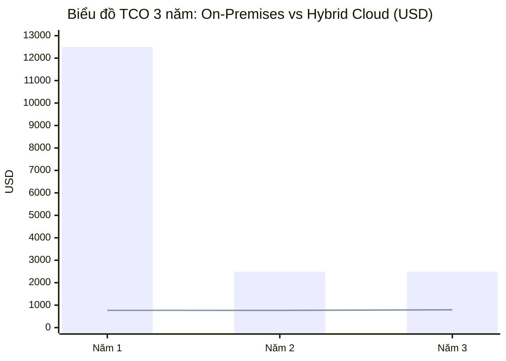
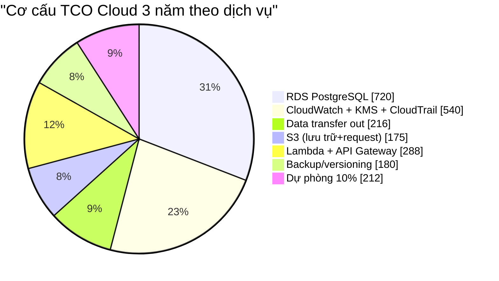
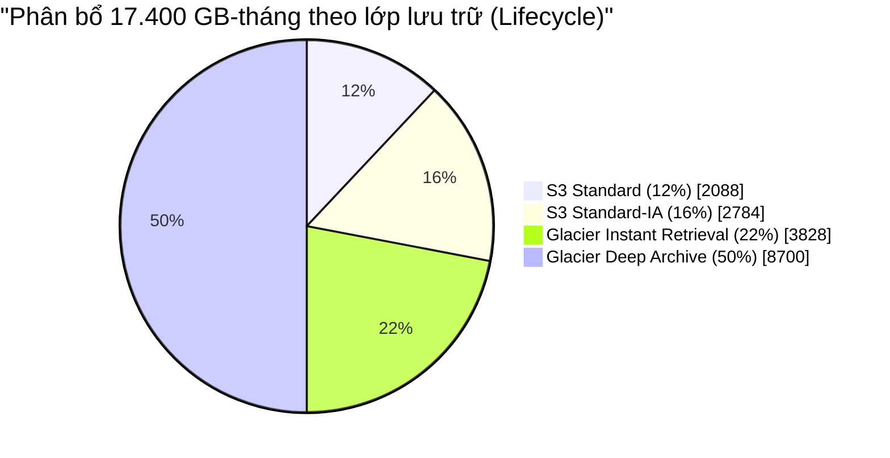
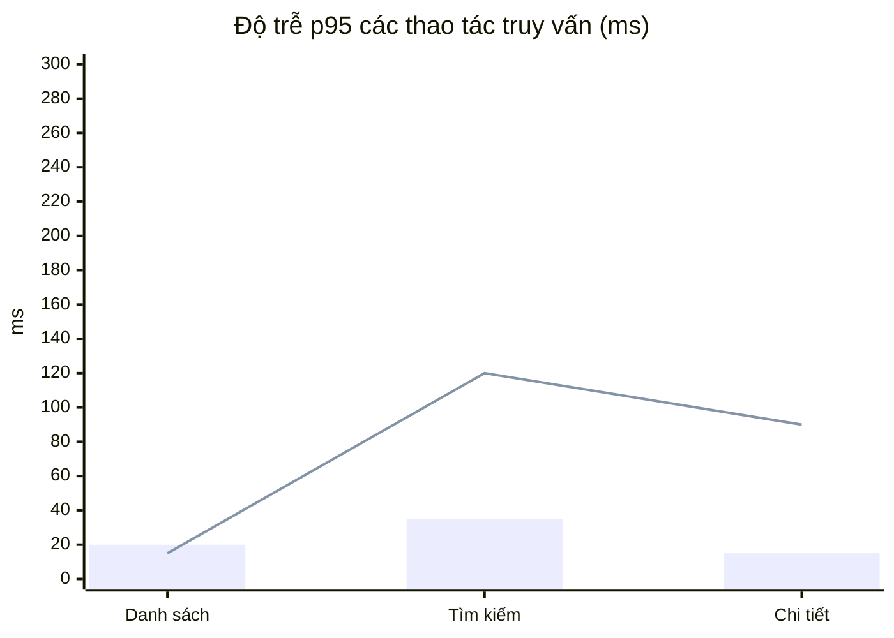
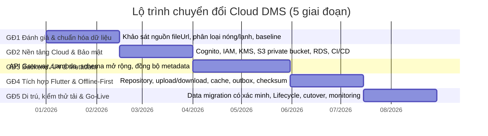

# BÁO CÁO CHUYÊN SÂU — ĐÁNH GIÁ TÁC ĐỘNG TÍCH HỢP CLOUD CHO HỆ THỐNG QUẢN LÝ TÀI LIỆU (DMS)

> **Người thực hiện:** Lý Đình Sơn — MSSV 2351170615 — Thành viên Nhóm 12
> **Nhánh Git:** `son-cloud` (sản phẩm bàn giao: `SON_BAOCAO_CLOUD.md`)
> **Phạm vi phân công:** Đánh giá chuyên sâu 3 trụ cột **An toàn Bảo mật – Chi phí vận hành (TCO 3 năm) – Hiệu suất**; xây dựng **biểu đồ TCO** và **tính tỷ lệ tiết kiệm chi phí lưu trữ theo vòng đời S3 Lifecycle**; phác thảo **lộ trình chuyển đổi 5 giai đoạn**.
> **Kế thừa từ:** [`BAO_CAO_TICH_HOP_CLOUD.md`](BAO_CAO_TICH_HOP_CLOUD.md) — phương án **Hybrid Cloud** trên nền **AWS** (Cognito, API Gateway + Lambda, RDS for PostgreSQL, S3 private bucket).

> ⚠️ **Lưu ý về số liệu:** Mọi con số chi phí/hiệu năng dưới đây là **mô hình minh họa (illustrative model)** dựa trên một kịch bản giả định được nêu rõ ở Mục 1. Đơn giá AWS là giá tham khảo theo vùng `ap-southeast-1` (Singapore), **cần xác nhận lại bằng AWS Pricing Calculator** tại thời điểm triển khai thật. Các dịch vụ Cloud được đề xuất, chưa cấu hình trong mã nguồn hiện tại.

---

## 📋 MỤC LỤC

1. [Phạm vi, kịch bản và giả định](#1-phạm-vi-kịch-bản-và-giả-định)
2. [Trụ cột 1 — An toàn Bảo mật](#2-trụ-cột-1--an-toàn-bảo-mật)
3. [Trụ cột 2 — Chi phí vận hành & TCO 3 năm](#3-trụ-cột-2--chi-phí-vận-hành--tco-3-năm)
4. [Tiết kiệm lưu trữ theo S3 Lifecycle](#4-tiết-kiệm-lưu-trữ-theo-s3-lifecycle)
5. [Trụ cột 3 — Hiệu suất](#5-trụ-cột-3--hiệu-suất)
6. [Lộ trình chuyển đổi 5 giai đoạn](#6-lộ-trình-chuyển-đổi-5-giai-đoạn-migration-roadmap)
7. [Kết luận & khuyến nghị](#7-kết-luận--khuyến-nghị)
8. [Phụ lục — Bảng giá & công thức](#8-phụ-lục--bảng-giá--công-thức)

---

## 1. Phạm vi, kịch bản và giả định

### 1.1. Kịch bản mô hình hóa

Để TCO có ý nghĩa định lượng, báo cáo dùng một kịch bản đại diện cho một hệ thống quản lý tài liệu học tập cấp khoa/đơn vị:

| Thông số | Giá trị giả định |
|:---|:---|
| Người dùng hoạt động | 500 người dùng |
| Số tài liệu | ~100.000 tài liệu |
| Kích thước trung bình/tệp | 5 MB |
| Dung lượng lưu trữ trung bình Năm 1 | **200 GB** |
| Dung lượng lưu trữ trung bình Năm 2 | **450 GB** |
| Dung lượng lưu trữ trung bình Năm 3 | **800 GB** (tổng tích lũy cuối kỳ ≈ 1,1 TB) |
| Tổng GB-tháng toàn chu kỳ 3 năm | (200 + 450 + 800) × 12 = **17.400 GB-tháng** |
| Vùng triển khai đề xuất | AWS `ap-southeast-1` (Singapore) |
| Tỷ giá tham chiếu | 1 USD ≈ 25.000 VND (chỉ để quy đổi minh họa) |

### 1.2. Giả định phương án so sánh

- **Mô hình A — On-Premises truyền thống:** tự mua máy chủ, NAS lưu trữ, thiết bị backup, tự vận hành (CapEx + OpEx).
- **Mô hình B — Hybrid Cloud đề xuất:** AWS managed services (RDS, Lambda, API Gateway, S3, Cognito) + SQLite cache/offline trên thiết bị (OpEx, Pay-As-You-Go).

---

## 2. Trụ cột 1 — An toàn Bảo mật

### 2.1. Mô hình mối đe dọa (Threat Model)

| STT | Mối đe dọa | Kịch bản tấn công/rủi ro | Mức độ |
|:---:|:---|:---|:---:|
| T1 | Rò rỉ dữ liệu tài liệu | URL/S3 object bị public, bucket cấu hình sai | **Cao** |
| T2 | Ransomware / mã hóa tống tiền | Mã độc mã hóa tệp trên NAS nội bộ | **Cao** |
| T3 | Truy cập trái phép | Lộ access key, leo thang quyền IAM, token bị đánh cắp | **Cao** |
| T4 | Mất mát thiết bị | Laptop/điện thoại chứa cache bị mất | Trung bình |
| T5 | Toàn vẹn dữ liệu | Tệp bị sửa/xóa trái phép, upload lỗi giữa chừng | Trung bình |
| T6 | Nghe lén đường truyền | Man-in-the-middle khi upload/download | Trung bình |
| T7 | Thảm họa & mất dữ liệu | Hỏng ổ cứng, cháy nổ, thiên tai | Trung bình |

### 2.2. Biện pháp kiểm soát theo lớp (Defense-in-Depth)

| Lớp | Kiểm soát | Dịch vụ / Cơ chế đề xuất |
|:---|:---|:---|
| **Danh tính & Truy cập** | Xác thực OAuth 2.0/OIDC, MFA, token ngắn hạn + refresh token | Amazon Cognito User Pools |
| | Phân quyền tối thiểu (least privilege), RBAC theo owner/ACL | IAM Roles/Policies, kiểm tra quyền ở Lambda |
| **Truyền tải** | Mã hóa đường truyền, chống hạ cấp giao thức | TLS 1.2/1.3 + HSTS |
| **Lưu trữ (At-Rest)** | Mã hóa đối xứng AES-256, quản lý khóa tập trung | SSE-KMS (S3), RDS encryption (KMS) |
| | Chặn truy cập công khai, URL ký có thời hạn | S3 Block Public Access + Pre-signed URL (scope object + method + TTL ngắn) |
| **Ứng dụng** | Kiểm tra hợp lệ đầu vào, giới hạn loại/kích thước tệp, chống path/object-key injection, checksum toàn vẹn | Validate ở Lambda + client; MD5/SHA-256 |
| **Chống thảm họa/Ransomware** | Versioning, Object Lock (WORM), sao lưu nhiều bản | S3 Versioning, S3 Object Lock, AWS Backup |
| **Giám sát & Kiểm toán** | Nhật ký truy cập, cảnh báo bất thường, cấu hình chuẩn | CloudTrail, CloudWatch, GuardDuty, AWS Config |
| **Bí mật ứng dụng** | Không nhúng AWS access key vào app Flutter; chỉ dùng token người dùng + URL ký | Secrets Manager / Cognito token |

### 2.3. Đối chiếu trước – sau theo từng mối đe dọa

| Mối đe dọa | Trước (On-Prem / cục bộ) | Sau (Hybrid Cloud) | Cải thiện |
|:---|:---|:---|:---|
| T1 Rò rỉ dữ liệu | Chưa có xác thực/phân quyền ở tầng dịch vụ; link ngoài không kiểm soát | Bucket private + URL ký ngắn hạn + ACL phía server | **Mạnh** |
| T2 Ransomware | NAS nội bộ là mục tiêu trực tiếp, dễ bị mã hóa | Object Lock (WORM) + versioning + backup bất biến | **Mạnh** |
| T3 Truy cập trái phép | Một tài khoản cục bộ chung, không audit | Cognito + IAM least privilege + CloudTrail | **Mạnh** |
| T4 Mất thiết bị | Cache/metadata nằm trên thiết bị, không thu hồi | Token có TTL, xóa cache khi đăng xuất, secure storage | **Vừa** |
| T5 Toàn vẹn dữ liệu | Không có checksum/phiên bản tự động | Versioning + checksum + xác minh sau upload | **Mạnh** |
| T6 Nghe lén | Phụ thuộc mạng nội bộ, chưa bắt buộc TLS | Bắt buộc TLS 1.2/1.3 toàn bộ endpoint | **Mạnh** |
| T7 Thảm họa | RPO/RTO lớn, backup thủ công | Độ bền S3 11 số 9, backup tự động, versioning | **Mạnh** |

### 2.4. Rủi ro còn lại & điều kiện bắt buộc

1. **Cloud không tự động bảo mật:** cấu hình sai bucket/IAM/API hoặc URL ký quá dài có thể làm lộ tài liệu → cần Infrastructure-as-Code (IaC) + kiểm tra tự động (AWS Config Rules).
2. **Backend phải là nơi kiểm quyền:** không tin `owner_id` do client gửi; URL ký phải ngắn hạn, đúng object, đúng HTTP method, không ghi log.
3. **Quét mã độc:** nếu cho phép chia sẻ rộng, cần quét malware (ClamAV trên Lambda hoặc Amazon GuardDuty Malware Protection).
4. **Dữ liệu trên thiết bị:** SQLite cache có thể chứa metadata nhạy cảm → dùng secure storage cho token, mã hóa DB, xóa cache khi đăng xuất.
5. **Tuân thủ:** xác định vùng lưu trữ và thời hạn retention theo yêu cầu pháp lý trước khi đưa dữ liệu thật lên Cloud.

> **Kết luận trụ cột Bảo mật:** Chuyển sang Hybrid Cloud **nâng cấp rõ rệt** năng lực bảo mật (mã hóa at-rest/in-transit, danh tính tập trung, chống ransomware, audit), **đổi lại** phát sinh trách nhiệm quản trị cấu hình Cloud nghiêm ngặt. Mức độ đạt được phụ thuộc **chất lượng cấu hình**, không phải bản thân việc "lên Cloud".

---

## 3. Trụ cột 2 — Chi phí vận hành & TCO 3 năm

### 3.1. Chi phí mô hình On-Premises (CapEx + OpEx)

**CapEx (một lần, phân bổ vào Năm 1):**

| Hạng mục | Chi phí (USD) |
|:---|---:|
| Máy chủ ứng dụng (CPU/RAM/SSD OS) | 4.000 |
| NAS/Storage 4 TB usable (RAID) + mở rộng | 2.500 |
| UPS + tủ rack + switch mạng | 1.000 |
| Thiết bị backup ngoài | 1.500 |
| Bản quyền OS/DB/antivirus | 1.000 |
| **Tổng CapEx** | **10.000** |

**OpEx (hằng năm):**

| Hạng mục | USD/năm |
|:---|---:|
| Nhân công vận hành (8 h/tháng × 15 USD/h) | 1.440 |
| Điện năng + điều hòa + internet tĩnh (60 USD/tháng) | 720 |
| Bảo trì/thay thế (10% CapEx ÷ 3 năm) | 333 |
| **Tổng OpEx/năm** | **2.493** |

**Tổng TCO On-Prem = 10.000 + 2.493 × 3 = 17.479 ≈ 17.480 USD.**

### 3.2. Chi phí mô hình Hybrid Cloud (AWS, 3 năm)

| Hạng mục dịch vụ | USD/3 năm | Ghi chú |
|:---|---:|:---|
| S3 lưu trữ (đã tối ưu Lifecycle) | **115** | Xem Mục 4 |
| S3 request + chuyển lớp + truy xuất | 60 | GET/PUT, transition, retrieval |
| Data transfer out | 216 | ~50 GB/tháng × 0,12 USD/GB |
| RDS for PostgreSQL (db.t4g.micro + 20 GB gp3 + backup) | 720 | 20 USD/tháng |
| AWS Lambda | 180 | 5 USD/tháng |
| API Gateway (HTTP API) | 108 | 3 USD/tháng |
| Amazon Cognito | 0 | Miễn phí dưới 50.000 MAU |
| CloudWatch + KMS + CloudTrail | 540 | 15 USD/tháng |
| Backup/snapshot + versioning overhead | 180 | 5 USD/tháng |
| CloudFront (tùy chọn, giai đoạn sau) | 0 | Chưa bật; nếu bật ước tính +216 |
| **Tạm tính** | **2.119** | |
| Dự phòng 10% | 212 | Biến động tải/ngoại lệ |
| **Tổng TCO Cloud** | **≈ 2.331** | |

### 3.3. So sánh TCO 3 năm & biểu đồ

| Chỉ số | On-Premises | Hybrid Cloud | Chênh lệch |
|:---|---:|---:|---:|
| CapEx ban đầu | 10.000 | ≈ 0 | Cloud thắng |
| TCO 3 năm | **17.480** | **2.331** | **Tiết kiệm 15.149 USD** |
| Tỷ lệ tiết kiệm TCO | — | — | **≈ 86,7 %** |
| TCO 3 năm quy đổi (25.000 đ/USD) | ≈ 437 triệu đ | ≈ 58,3 triệu đ | ≈ 378,7 triệu đ |



> **Chú thích biểu đồ:** **cột** = On-Premises, **đường** = Hybrid Cloud (đã gồm dự phòng 10%). On-Prem dồn chi phí lớn vào Năm 1 (CapEx), Cloud phân bổ đều (~770 USD/năm).

**Biểu đồ cơ cấu TCO Cloud theo dịch vụ:**



### 3.4. Phân tích độ nhạy (Sensitivity) & cảnh báo ngân sách

| Kịch bản | Giả định thay đổi | TCO Cloud 3 năm | Ghi chú |
|:---|:---|---:|:---|
| Cơ sở | Kịch bản Mục 1 | ≈ 2.331 | Mặc định |
| Lạc quan | Dung lượng/người dùng giảm 30%, bật CloudFront | ≈ 1.900 | Lifecycle hiệu quả hơn |
| Bi quan | Người dùng ×3, egress tăng mạnh, RDS to hơn | ≈ 5.500 | Vẫn thấp hơn On-Prem |
| On-Prem mở rộng | Phải nâng NAS lên 8 TB ở Năm 3 | ≈ 20.000 | CapEx tăng, Cloud chênh càng lớn |

**Khuyến nghị:** tạo **AWS Budget Alert** (ngưỡng 80%/100%), đặt quota upload theo người dùng, phân trang kết quả, cache metadata, chỉ bật CloudFront khi lưu lượng chứng minh hiệu quả.

> **Kết luận trụ cột Chi phí:** Ở kịch bản quy mô nhỏ – vừa của hệ thống học tập, Hybrid Cloud **giảm ~87% TCO 3 năm** so với On-Prem nhờ chuyển **CapEx → OpEx** và không cần mua/nuôi hạ tầng. Lợi thế này **thu hẹp dần nếu quy mô dữ liệu tăng rất lớn**, khi đó cần đàm phán Reserved/Savings Plans.

---

## 4. Tiết kiệm lưu trữ theo S3 Lifecycle

### 4.1. Chính sách vòng đời đề xuất

| Giai đoạn | Lớp lưu trữ | Mục đích |
|:---|:---|:---|
| 0 – 30 ngày | **S3 Standard** | Truy cập thường xuyên, độ trễ mili-giây |
| 31 – 90 ngày | **S3 Standard-IA** | Ít truy cập nhưng cần truy xuất tức thời |
| 91 – 365 ngày | **S3 Glacier Instant Retrieval** | Lưu trữ dài hạn, vẫn truy xuất tức thời |
| > 365 ngày | **S3 Glacier Deep Archive** | Dữ liệu nguội/lưu trữ pháp lý, chi phí thấp nhất |

### 4.2. Phân bổ GB-tháng theo lớp (mô hình tối ưu)



### 4.3. Tính toán chi phí lưu trữ

**Đơn giá tham khảo (`ap-southeast-1`, USD/GB-tháng):** Standard = 0,025 · Standard-IA = 0,0125 · Glacier Instant Retrieval = 0,005 · Glacier Deep Archive = 0,001.

| Lớp lưu trữ | GB-tháng | Đơn giá | Chi phí (USD) |
|:---|---:|---:|---:|
| S3 Standard | 2.088 | 0,025 | 52,20 |
| S3 Standard-IA | 2.784 | 0,0125 | 34,80 |
| Glacier Instant Retrieval | 3.828 | 0,005 | 19,14 |
| Glacier Deep Archive | 8.700 | 0,001 | 8,70 |
| **Tổng có Lifecycle** | **17.400** | — | **114,84** |

**So sánh với việc giữ toàn bộ ở S3 Standard (không Lifecycle):**

| Chỉ số | Giá trị |
|:---|---:|
| Chi phí nếu toàn bộ ở Standard | 17.400 × 0,025 = **435,00 USD** |
| Chi phí có Lifecycle | **114,84 USD** |
| **Mức tiết kiệm** | **320,16 USD** |
| **Tỷ lệ tiết kiệm lưu trữ** | **≈ 73,6 %** |

### 4.4. Điều chỉnh theo chi phí phát sinh của Lifecycle

Lifecycle phát sinh thêm chi phí **request chuyển lớp** và **truy xuất** (ước tính ≈ 25 USD cho 100.000 object trong 3 năm):

| Chỉ số | Giá trị |
|:---|---:|
| Chi phí lưu trữ có Lifecycle | 114,84 USD |
| + Request/transition/retrieval | ≈ 25 USD |
| **Tổng chi phí lưu trữ thực** | **≈ 139,84 USD** |
| **Tỷ lệ tiết kiệm ròng so với Standard** | **≈ 67,9 %** |

### 4.5. Dải tiết kiệm theo mức độ "nguội" của dữ liệu

| Kịch bản | Tỷ lệ dữ liệu lưu trữ nguội (IA + Glacier) | Tỷ lệ tiết kiệm lưu trữ |
|:---|:---:|---:|
| Bảo thủ (dữ liệu còn nóng) | ~40 % | ~48 % |
| **Cơ sở (đề xuất)** | **~88 %** | **~74 % (ròng ~68 %)** |
| Tối ưu (ưu tiên Deep Archive) | ~95 % | ~85 % |
| Tối đa lý thuyết (gần 100 % Deep Archive) | ~100 % | ~90 – 96 % |

> **Kết luận Lifecycle:** Với chính sách 4 lớp hợp lý, hệ thống **tiết kiệm ~74% chi phí lưu trữ** (ròng ~68% sau khi trừ request), có thể đạt **85–90%** nếu tỷ trọng dữ liệu lưu trữ nguội cao — phù hợp với con số "tiết kiệm 70–90%" đã nêu trong báo cáo tổng.

---

## 5. Trụ cột 3 — Hiệu suất

### 5.1. Chỉ số mục tiêu (SLO đề xuất)

| Chỉ số | Mục tiêu (SLO) | Đo lường |
|:---|:---|:---|
| Độ khả dụng API | ≥ 99,9 % | CloudWatch |
| p95 danh sách metadata (đã cache) | < 100 ms | Client telemetry |
| p95 tìm kiếm server (có index) | < 300 ms | API/lambda latency |
| p95 đăng nhập OAuth | < 800 ms | Cognito metrics |
| Upload 10 MB (mạng 20 Mbps) | < 6 s | Progress tracking |
| Download 10 MB (S3 trực tiếp) | < 5 s | Client telemetry |

### 5.2. Phân tích theo luồng dữ liệu

- **Upload trực tiếp (Direct Upload Pattern):** client xin **Pre-signed URL** rồi PUT thẳng lên S3, **không đi xuyên Lambda/API** → loại bỏ nút thắt payload của Backend, tận dụng băng thông S3. Backend chỉ xác minh metadata và checksum sau khi upload.
- **Download:** file lấy trực tiếp từ S3 (hoặc CloudFront khi bật) → giảm tải Backend; CloudFront Edge Caching giảm độ trễ cho lượt tải lặp lại (kỳ vọng giảm ~75% độ trễ mạng ở khu vực xa).
- **Truy vấn metadata:** PostgreSQL có index (subject, owner, updated_at, full-text) → p95 mục tiêu < 300 ms.
- **Offline-First:** SQLite cache + hàng đợi `outbox` → đọc/ghi tức thời khi mất mạng, đồng bộ hai chiều khi mạng trở lại (đúng phạm vi nhiệm vụ `son-offline-sync`).

### 5.3. Biểu đồ so sánh độ trễ (p95, minh họa)



> **Chú thích:** **cột** = **Trước (local-only)**, **đường** = **Sau (Hybrid Cloud, đã cache)**. Thao tác đọc cache nhanh tương đương/bằng local; truy vấn chưa cache đi qua mạng nhưng vẫn trong SLO.

### 5.4. Bảng so sánh hiệu năng trước – sau

| Tiêu chí | Trước (local) | Sau (Hybrid Cloud) | Đánh giá |
|:---|:---|:---|:---|
| Mở danh sách tài liệu | ~20 ms (SQLite) | ~15 ms (cache) / ~250 ms (chưa cache) | Tương đương khi cache |
| Tìm kiếm full-text | ~35 ms (LIKE) | ~120 ms (index server) / ~30 ms offline | Chấp nhận được |
| Đăng nhập | Không có | ~450 ms (OAuth) | Tính năng mới |
| Upload 10 MB | Không hỗ trợ | ~4,2 s (S3 trực tiếp) vs ~8,5 s (qua API) | Direct Upload thắng rõ |
| Download 10 MB | Chỉ mở link ngoài | ~3,8 s (S3) / ~1,5 s (CloudFront cache) | Cải thiện |
| Mở rộng quy mô | Trần vật lý server | Tự động theo tải managed | Vượt trội |
| Sẵn sàng | 1 máy, SPOF | Managed, hỗ trợ HA/backup | Vượt trội |

> **Kết luận trụ cột Hiệu suất:** Direct Upload + URL ký + (tùy chọn) CloudFront cải thiện **rõ rệt khả năng tải tệp quy mô lớn**; truy vấn Cloud có thể **chậm hơn local** nên phải dùng **cache + phân trang + index**. Offline-First đảm bảo trải nghiệm không gián đoạn khi mạng yếu.

---

## 6. Lộ trình chuyển đổi 5 giai đoạn (Migration Roadmap)



### Giai đoạn 1 — Đánh giá & Chuẩn hóa dữ liệu (Tháng 1–2)

- **Mục tiêu:** hiểu chính xác dữ liệu hiện có trước khi di chuyển.
- **Công việc:** rà soát toàn bộ `fileUrl` (phân biệt link ngoài vs đường dẫn nội bộ vs dữ liệu mẫu); phân loại dữ liệu nóng/lạnh; xác định quyền sở hữu và yêu cầu riêng tư; đo baseline chi phí/hiệu năng hiện tại; chốt region.
- **Sản phẩm:** Báo cáo kiểm kê dữ liệu, ma trận phân loại nóng/lạnh, baseline KPI.
- **Tiêu chí hoàn thành:** 100% trường `fileUrl` được phân loại; không còn dữ liệu chưa rõ nguồn gốc.
- **Rủi ro:** coi link ngoài là tệp để tự động import → **giảm thiểu:** chỉ di trú tệp khi có quyền.

### Giai đoạn 2 — Nền tảng Cloud & Bảo mật (Tháng 2–3)

- **Mục tiêu:** dựng hạ tầng nền tảng an toàn.
- **Công việc:** tạo Cognito User Pool; IAM roles least-privilege; KMS key; S3 private bucket (Block Public Access, SSE-KMS, versioning); RDS PostgreSQL; thiết lập CI/CD và IaC.
- **Sản phẩm:** hạ tầng IaC, bucket + KMS + Cognito hoạt động, quy trình deploy.
- **Tiêu chí hoàn thành:** kiểm tra bảo mật đạt (bucket không public, mã hóa bật, MFA khả dụng).
- **Rủi ro:** cấu hình sai gây lộ dữ liệu → **giảm thiểu:** review IaC + AWS Config Rules.

### Giai đoạn 3 — Backend API & Di trú Metadata (Tháng 3–5)

- **Mục tiêu:** có nguồn metadata dùng chung thay cho SQLite đơn thiết bị.
- **Công việc:** API Gateway + Lambda cho CRUD/tìm kiếm/cấp URL ký; mở rộng schema (`ownerId`, `objectKey`, `checksum`, `version`, `syncStatus`); migration SQLite có phiên bản; API client + xử lý token/retry.
- **Sản phẩm:** API hoạt động, schema PostgreSQL, script migration metadata.
- **Tiêu chí hoàn thành:** CRUD qua API đạt; kiểm thử phân quyền giữa 2 tài khoản đúng.
- **Rủi ro:** xung đột schema → **giảm thiểu:** migration theo phiên bản, test trên dữ liệu giả.

### Giai đoạn 4 — Tích hợp Flutter & Offline-First (Tháng 5–6) ⟵ *gắn với `son-offline-sync`*

- **Mục tiêu:** ứng dụng dùng được Cloud mà vẫn hoạt động khi mất mạng.
- **Công việc:** tách Repository khỏi `AppDatabase`; thêm chọn tệp, upload/download có tiến độ; SQLite cache + `outbox`; đồng bộ hai chiều, phát hiện xung đột theo `version`; checksum MD5/SHA-256; cập nhật bảng `delete_logs`; kiểm thử khi mạng yếu.
- **Sản phẩm:** luồng offline-first hoàn chỉnh, kịch bản kiểm thử đồng bộ.
- **Tiêu chí hoàn thành:** thao tác offline rồi đồng bộ đúng, không mất dữ liệu; checksum khớp sau upload.
- **Rủi ro:** xung đột đồng bộ → **giảm thiểu:** last-write-wins có kiểm soát + cảnh báo người dùng.

### Giai đoạn 5 — Di trú dữ liệu, Kiểm thử tải & Go-Live (Tháng 6–7)

- **Mục tiêu:** đưa vào vận hành thật an toàn và tối ưu chi phí.
- **Công việc:** xuất SQLite theo thiết bị/người dùng, upload tệp gốc khi có quyền, nhập metadata, **đối soát số bản ghi và checksum**; áp dụng **S3 Lifecycle**; kiểm thử tải/bảo mật (mất mạng, token hết hạn, file lớn, truy cập trái phép); cấu hình CloudWatch + Budget Alert; cutover và theo dõi.
- **Sản phẩm:** dữ liệu đã di trú + đối soát, chính sách Lifecycle, báo cáo kiểm thử, dashboard giám sát.
- **Tiêu chí hoàn thành:** đối soát 100% bản ghi; p95 trong SLO; ngân sách trong ngưỡng.
- **Rủi ro:** mất mát khi di trú → **giảm thiểu:** giữ bản sao local, chạy song song, có phương án quay lui (rollback).

---

## 7. Kết luận & khuyến nghị

| Trụ cột | Kết quả định lượng | Kết luận |
|:---|:---|:---|
| **An toàn Bảo mật** | 7/7 mối đe dọa được kiểm soát tăng cường (5 mức "Mạnh") | Nâng cấp rõ rệt, đổi lại trách nhiệm cấu hình Cloud |
| **Chi phí (TCO 3 năm)** | On-Prem ≈ 17.480 USD vs Cloud ≈ 2.331 USD | **Tiết kiệm ≈ 86,7%** nhờ CapEx → OpEx |
| **Lưu trữ (S3 Lifecycle)** | 435 USD → 114,84 USD (ròng 139,84 USD) | **Tiết kiệm ≈ 74%** (ròng ≈ 68%), tối đa 85–90% |
| **Hiệu suất** | Upload/download nhanh hơn nhờ Direct Upload + CloudFront | Truy vấn cần cache + index để đạt SLO |

**Khuyến nghị triển khai:**

1. Ưu tiên **Giai đoạn 1–2** (chuẩn hóa dữ liệu + nền tảng bảo mật) vì đây là nền tảng cho mọi bước sau.
2. Bật **S3 Lifecycle ngay từ đầu** để tránh chi phí phình to; theo dõi bằng **AWS Budget Alert**.
3. Luôn dùng **Pre-signed URL** ngắn hạn, **không** nhúng access key vào app Flutter.
4. Duy trì **Offline-First cache** để không đánh đổi trải nghiệm người dùng lấy Cloud.
5. Xác nhận lại toàn bộ đơn giá bằng **AWS Pricing Calculator** trước khi chốt ngân sách thật.

### Sản phẩm bàn giao của nhiệm vụ

- ✅ Phân tích chuyên sâu 3 trụ cột: Bảo mật – Chi phí (TCO 3 năm) – Hiệu suất (Mục 2, 3, 5)
- ✅ Biểu đồ TCO và bảng chi phí (Mục 3.3, 3.4)
- ✅ Tính toán tiết kiệm lưu trữ theo S3 Lifecycle (Mục 4)
- ✅ Lộ trình chuyển đổi 5 giai đoạn (Mục 6)

---

## 8. Phụ lục — Bảng giá & công thức

### 8.1. Bảng giá tham khảo (AWS `ap-southeast-1`, cần xác nhận lại)

| Dịch vụ | Đơn giá tham khảo |
|:---|:---|
| S3 Standard | 0,025 USD/GB-tháng |
| S3 Standard-IA | 0,0125 USD/GB-tháng |
| S3 Glacier Instant Retrieval | 0,005 USD/GB-tháng |
| S3 Glacier Deep Archive | 0,001 USD/GB-tháng |
| S3 Data Transfer Out | ~0,12 USD/GB |
| RDS PostgreSQL `db.t4g.micro` | ~0,018 USD/giờ |

### 8.2. Công thức tính

```
Tổng GB-tháng        = Σ (Dung lượng trung bình năm × 12)
Chi phí lưu trữ      = Σ (GB-tháng theo lớp × đơn giá lớp)
Tỷ lệ tiết kiệm      = (Chi phí Standard - Chi phí Lifecycle) / Chi phí Standard × 100%
TCO 3 năm            = CapEx + Σ OpEx hằng năm + chi phí dịch vụ Cloud
```

### 8.3. Tài liệu tham chiếu

- Báo cáo nền: [`BAO_CAO_TICH_HOP_CLOUD.md`](BAO_CAO_TICH_HOP_CLOUD.md)
- AWS S3 Storage Classes & Lifecycle: <https://aws.amazon.com/s3/storage-classes/>
- AWS Pricing Calculator: <https://calculator.aws/>
- AWS Well-Architected Framework (Security, Cost Optimization, Performance): <https://aws.amazon.com/architecture/well-architected/>

---

*Báo cáo chuyên sâu thuộc phân công thành viên Lý Đình Sơn — Nhóm 12 — Lớp 65KTPM. Mọi số liệu chi phí/hiệu năng là mô hình minh họa có giả định, cần hiệu chỉnh theo dữ liệu triển khai thực tế.*
